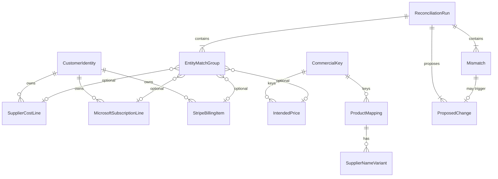

# Data Model: Billing Drift Domain

**Feature**: `001-billing-domain-model`  
**Project**: `BillDrift.Domain`  
**Date**: 2026-07-01

## Overview

The domain model has two layers:

| Layer | Namespace | Purpose |
|-------|-----------|---------|
| **Raw import** | `BillDrift.Domain.Import` | Faithful capture of external source data |
| **Normalized** | `BillDrift.Domain.Billing`, `.Mapping`, `.Reconciliation` | Comparable, immutable business entities |

Shared value objects live in `BillDrift.Domain.Common`.



---

## Common Value Objects (`BillDrift.Domain.Common`)

### Identifiers (readonly record struct wrappers)

| Type | Underlying | Validation |
|------|------------|------------|
| `MexId` | `string` | Non-empty, trimmed |
| `TenantId` | `string` | Non-empty when present |
| `OfferId` | `string` | Non-empty |
| `SkuId` | `string` | Non-empty |
| `StripeCustomerId` | `string` | Prefix `cus_` when from Stripe |
| `StripeSubscriptionId` | `string` | Prefix `sub_` |
| `StripeSubscriptionItemId` | `string` | Prefix `si_` |
| `StripeProductId` | `string` | Prefix `prod_` |
| `StripePriceId` | `string` | Prefix `price_` |
| `SupplierReferenceId` | `string` | Non-empty when present |
| `SupplierSubscriptionId` | `string` | Non-empty when present |

### `Money`

```csharp
public readonly record struct Money(decimal Amount, CurrencyCode Currency)
{
    public static Money Gbp(decimal amount) => new(amount, CurrencyCode.Gbp);
}
public readonly record struct CurrencyCode(string Value); // ISO 4217, e.g. "GBP"
```

**Validation**: `Amount >= 0` for prices; supplier cost lines may allow negative for credits (pro-rated adjustments) — validated at `SupplierCostLine` level.

### `BillingPeriod`

```csharp
public readonly record struct BillingPeriod(DateOnly Start, DateOnly End)
```

**Validation**: `End >= Start`.

### `Term`

```csharp
public enum Term { Monthly, Annual, P1M, P1Y, Unknown }
```

Maps from Giacom/Stripe source strings during normalization (rules in Application layer).

### `BillingFrequency`

```csharp
public enum BillingFrequency { Monthly, Annual, Unknown }
```

### `CommercialKey`

```csharp
public readonly record struct CommercialKey(
    OfferId OfferId,
    SkuId SkuId,
    Term Term,
    BillingFrequency Frequency);
```

**Validation**: `OfferId` and `SkuId` required. Used for price list and Stripe price alignment.

### `CommercialKeyRoot`

Product identity without term/frequency — used by `ProductMapping`:

```csharp
public readonly record struct CommercialKeyRoot(OfferId OfferId, SkuId SkuId);
```

### `CustomerIdentity`

```csharp
public sealed record CustomerIdentity(
    MexId MexId,
    string? DisplayName = null,
    TenantId? TenantId = null,
    StripeCustomerId? StripeCustomerId = null);
```

**Validation**: `MexId` required.

### `SourceReference`

Links any normalized entity back to raw import:

```csharp
public readonly record struct SourceReference(
    ImportSourceKind SourceKind,
    string SourceDocumentId,
    string SourceLineKey);
```

### `ImportSourceKind`

```csharp
public enum ImportSourceKind
{
    GiacomBillingPdf,
    GiacomSubscriptionManagement,
    GiacomPriceList,
    ManualPriceEntry,
    StripeExport
}
```

### `RawImportId`

```csharp
public readonly record struct RawImportId(ImportSourceKind SourceKind, string SourceDocumentId, string SourceLineKey);
```

**Idempotency**: Same triple → same raw record on re-import.

---

## Raw Import Layer (`BillDrift.Domain.Import`)

All raw types are `sealed record` with stringly-typed source fields where parsing is deferred.

### `RawGiacomBillingLine`

| Field | Type | Notes |
|-------|------|-------|
| `Id` | `RawImportId` | Composite idempotency key |
| `MexIdRaw` | `string` | As extracted |
| `ProductNameRaw` | `string` | As written on PDF |
| `QuantityRaw` | `string` | Parsed in normalization |
| `ChargeTypeRaw` | `string` | e.g. "Recurring", "Pro-rated adjustment" |
| `PeriodStartRaw` | `string?` | |
| `PeriodEndRaw` | `string?` | |
| `LineCostRaw` | `string` | |
| `SupplierReferenceIds` | `IReadOnlyList<string>` | All reference columns from PDF |
| `SourceDocumentId` | `string` | Blob path or upload ID |
| `ExtractedAt` | `DateTimeOffset` | Import timestamp |

### `RawSubscriptionManagementRow`

| Field | Type |
|-------|------|
| `Id` | `RawImportId` |
| `CustomerNameRaw` | `string` |
| `MexIdRaw` | `string` |
| `TenantIdRaw` | `string?` |
| `OfferIdRaw` | `string` |
| `SkuIdRaw` | `string` |
| `LicencesRaw` | `string` |
| `TermRaw` | `string` |
| `FrequencyRaw` | `string` |
| `RenewalDateRaw` | `string?` |
| `StatusRaw` | `string` |
| `SupplierSubscriptionIdRaw` | `string?` |
| `SourceDocumentId` | `string` |
| `RowNumber` | `int` |

### `RawPriceListRow`

| Field | Type |
|-------|------|
| `Id` | `RawImportId` |
| `OfferIdRaw` | `string` |
| `SkuIdRaw` | `string` |
| `TermRaw` | `string` |
| `FrequencyRaw` | `string` |
| `WholesaleRaw` | `string` |
| `RrpRaw` | `string` |
| `MarginRaw` | `string?` |
| `MarginPercentRaw` | `string?` |
| `StatusRaw` | `string` |
| `SourceDocumentId` | `string` |
| `RowNumber` | `int` |

### `RawManualPriceEntry`

| Field | Type |
|-------|------|
| `Id` | `RawImportId` |
| `OfferIdRaw` | `string?` |
| `SkuIdRaw` | `string?` |
| `TermRaw` | `string` |
| `FrequencyRaw` | `string` |
| `WholesaleRaw` | `string?` |
| `RrpRaw` | `string` |
| `Reason` | `string` |
| `EffectiveDate` | `DateOnly` |
| `EnteredAt` | `DateTimeOffset` |

### Stripe Raw Types

#### `RawStripeCustomer`

| Field | Type |
|-------|------|
| `CustomerId` | `string` |
| `Name` | `string?` |
| `Metadata` | `IReadOnlyDictionary<string, string>` |

#### `RawStripeSubscription`

| Field | Type |
|-------|------|
| `SubscriptionId` | `string` |
| `CustomerId` | `string` |
| `Status` | `string` |
| `Metadata` | `IReadOnlyDictionary<string, string>` |

#### `RawStripeSubscriptionItem`

| Field | Type |
|-------|------|
| `SubscriptionItemId` | `string` |
| `SubscriptionId` | `string` |
| `PriceId` | `string` |
| `ProductId` | `string` |
| `Quantity` | `long` |
| `Metadata` | `IReadOnlyDictionary<string, string>` |

#### `RawStripeProduct` / `RawStripePrice`

Standard Stripe export fields: IDs, `Name`, `UnitAmount`, `Currency`, `RecurringInterval`, `RecurringIntervalCount`, `Metadata`.

---

## Normalized Billing Entities (`BillDrift.Domain.Billing`)

Each entity has a domain-generated `Guid` ID and `SourceReference`.

### `SupplierCostLineId`, `MicrosoftSubscriptionLineId`, `IntendedPriceId`, `StripeBillingItemId`

```csharp
public readonly record struct SupplierCostLineId(Guid Value);
// ... similar for other entity IDs
```

### `SupplierCostLine`

| Field | Type | Validation |
|-------|------|------------|
| `Id` | `SupplierCostLineId` | Generated on normalize |
| `Customer` | `CustomerIdentity` | MexId required |
| `ProductName` | `string` | Normalized trim |
| `Quantity` | `int` | `>= 0` for recurring |
| `ChargeType` | `ChargeType` | `Recurring` \| `ProRatedAdjustment` |
| `Period` | `BillingPeriod` | Valid range |
| `LineCost` | `Money` | |
| `SupplierReferences` | `IReadOnlyList<SupplierReferenceId>` | |
| `Source` | `SourceReference` | |

### `MicrosoftSubscriptionLine`

| Field | Type | Validation |
|-------|------|------------|
| `Id` | `MicrosoftSubscriptionLineId` | |
| `Customer` | `CustomerIdentity` | MexId + TenantId when available |
| `CommercialKeyRoot` | `CommercialKeyRoot` | |
| `LicenceCount` | `int` | `>= 0` |
| `Term` | `Term` | |
| `Frequency` | `BillingFrequency` | |
| `RenewalDate` | `DateOnly?` | |
| `Status` | `SubscriptionStatus` | |
| `SupplierSubscriptionId` | `SupplierSubscriptionId?` | |
| `Source` | `SourceReference` | |

**Business rule**: Only `SubscriptionStatus.Active` lines participate in quantity reconciliation by default; suspended/cancelled flagged per run options (future).

### `IntendedPrice`

| Field | Type | Validation |
|-------|------|------------|
| `Id` | `IntendedPriceId` | |
| `Key` | `CommercialKey` | |
| `Wholesale` | `Money` | |
| `Rrp` | `Money` | |
| `Margin` | `Money?` | |
| `MarginPercent` | `decimal?` | 0–100 when present |
| `Status` | `PriceListStatus` | |
| `Source` | `PriceSource` | `Catalogue` \| `ManualOverride` |
| `SourceReference` | `SourceReference` | |

**Resolution rule**: For duplicate `CommercialKey`, `ManualOverride` beats `Catalogue` (FR-010).

### `StripeBillingItem`

Flattened subscription-item view for reconciliation (one row per billable item):

| Field | Type |
|-------|------|
| `Id` | `StripeBillingItemId` |
| `Customer` | `CustomerIdentity` |
| `SubscriptionId` | `StripeSubscriptionId` |
| `SubscriptionItemId` | `StripeSubscriptionItemId` |
| `ProductId` | `StripeProductId` |
| `PriceId` | `StripePriceId` |
| `Quantity` | `long` |
| `Frequency` | `BillingFrequency` |
| `UnitAmount` | `Money` |
| `MappingMetadata` | `StripeMappingMetadata` |
| `Source` | `SourceReference` |

### `StripeMappingMetadata`

| Field | Type |
|-------|------|
| `MexId` | `MexId?` |
| `OfferId` | `OfferId?` |
| `SkuId` | `SkuId?` |
| `SupplierReferences` | `IReadOnlyList<SupplierReferenceId>` |
| `Additional` | `IReadOnlyDictionary<string, string>` |

---

## Mapping (`BillDrift.Domain.Mapping`)

### `ProductMappingId`

```csharp
public readonly record struct ProductMappingId(Guid Value);
```

### `ProductMapping`

| Field | Type | Validation |
|-------|------|------------|
| `Id` | `ProductMappingId` | |
| `Key` | `CommercialKeyRoot` | |
| `NormalizedProductName` | `string` | Non-empty |
| `StripeProductId` | `StripeProductId` | |
| `StripePricesByTerm` | `IReadOnlyDictionary<PriceTermKey, StripePriceId>` | At least one entry for active products |
| `SupplierNameVariants` | `IReadOnlyList<SupplierNameVariant>` | |
| `Classification` | `ProductClassification` | `Csp` \| `NonCsp` |
| `Confidence` | `MappingConfidence` | |
| `MappingSource` | `MappingSource` | |

### `PriceTermKey`

```csharp
public readonly record struct PriceTermKey(Term Term, BillingFrequency Frequency);
```

### `SupplierNameVariant`

| Field | Type |
|-------|------|
| `NormalizedName` | `string` | Lowercase trimmed for lookup |
| `DisplayName` | `string` | Original variant text |

---

## Reconciliation (`BillDrift.Domain.Reconciliation`)

### `RunId`

```csharp
public readonly record struct RunId(Guid Value);
```

### `ReconciliationRun`

| Field | Type |
|-------|------|
| `Id` | `RunId` |
| `ExecutedAt` | `DateTimeOffset` |
| `Scope` | `BillingPeriod` |
| `Inputs` | `ReconciliationInputs` |
| `MatchGroups` | `IReadOnlyList<EntityMatchGroup>` |
| `Mismatches` | `IReadOnlyList<Mismatch>` |
| `ProposedChanges` | `IReadOnlyList<ProposedChange>` |

### `ReconciliationInputs`

| Field | Type |
|-------|------|
| `SupplierCostLines` | `IReadOnlyList<SupplierCostLine>` |
| `SubscriptionLines` | `IReadOnlyList<MicrosoftSubscriptionLine>` |
| `IntendedPrices` | `IReadOnlyList<IntendedPrice>` |
| `StripeItems` | `IReadOnlyList<StripeBillingItem>` |
| `ProductMappings` | `IReadOnlyList<ProductMapping>` |

**Snapshot identity**: Inputs should be treated as immutable collections; same content → same reconciliation output.

### `EntityMatchGroup`

| Field | Type |
|-------|------|
| `Id` | `MatchGroupId` |
| `Customer` | `CustomerIdentity` |
| `CommercialKey` | `CommercialKey?` |
| `SupplierCostLine` | `SupplierCostLine?` |
| `SubscriptionLine` | `MicrosoftSubscriptionLine?` |
| `IntendedPrice` | `IntendedPrice?` |
| `StripeItem` | `StripeBillingItem?` |
| `Confidence` | `MatchConfidence` |

### `Mismatch`

| Field | Type |
|-------|------|
| `Id` | `MismatchId` |
| `Type` | `MismatchType` |
| `Severity` | `MismatchSeverity` | `Info`, `Warning`, `Error` |
| `Customer` | `CustomerIdentity?` |
| `CommercialKey` | `CommercialKey?` |
| `InvolvedEntityIds` | `MismatchEntityRefs` | Typed refs to domain IDs |
| `ExpectedValue` | `string?` | Human-readable |
| `ActualValue` | `string?` | Human-readable |
| `Description` | `string` | Operator-facing |

### `MismatchEntityRefs`

Holds optional IDs for each domain entity involved in the mismatch.

### `ProposedChange`

| Field | Type |
|-------|------|
| `Id` | `ProposedChangeId` |
| `IdempotencyKey` | `IdempotencyKey` |
| `MismatchId` | `MismatchId` |
| `ActionType` | `ProposedActionType` |
| `Target` | `ProposedChangeTarget` |
| `ProposedValues` | `IReadOnlyDictionary<string, string>` |
| `CataloguePayload` | `CatalogueEntryPayload?` | For `CreateOrUpdateCatalogueEntry` |
| `ExecutionOrder` | `int` | Lower runs first |

### `IdempotencyKey`

```csharp
public readonly record struct IdempotencyKey(string Value);
// Format: "{RunId}:{MismatchId}:{ActionType}"
```

### `CatalogueEntryPayload`

| Field | Type |
|-------|------|
| `StripeProductId` | `StripeProductId?` |
| `NormalizedName` | `string` |
| `CommercialKeyRoot` | `CommercialKeyRoot` |
| `PricesToCreate` | `IReadOnlyList<PriceTermKey>` |

---

## Enumerations Summary

| Enum | Values |
|------|--------|
| `ChargeType` | `Recurring`, `ProRatedAdjustment` |
| `SubscriptionStatus` | `Active`, `Suspended`, `Cancelled`, `Pending`, `Unknown` |
| `PriceListStatus` | `Active`, `EndOfSale`, `Unknown` |
| `PriceSource` | `Catalogue`, `ManualOverride` |
| `ProductClassification` | `Csp`, `NonCsp` |
| `MappingConfidence` | `High`, `Medium`, `Low`, `Unmapped` |
| `MappingSource` | `Manual`, `Imported`, `Inferred` |
| `MismatchType` | `MissingInStripe`, `QuantityMismatch`, `BillingFrequencyMismatch`, `PriceMismatch`, `CatalogueMissing`, `MappingMissing`, `MappingAmbiguous` |
| `MismatchSeverity` | `Info`, `Warning`, `Error` |
| `ProposedActionType` | `UpdateQuantity`, `SwitchPrice`, `CreateMissingItem`, `CreateOrUpdateCatalogueEntry` |
| `MatchConfidence` | `High`, `Medium`, `Low`, `None` |

---

## Validation Summary

| Rule | Applies to |
|------|------------|
| MexId non-empty | CustomerIdentity, raw Mex fields before normalize |
| CommercialKey requires OfferId + SkuId | IntendedPrice, matching |
| Manual price overrides win on key collision | IntendedPrice resolution |
| ProRatedAdjustment excluded from recurring quantity totals | Supplier cost aggregation |
| Missing Stripe metadata → MappingMissing, not silent match | Reconciliation |
| Deterministic mismatch ordering | ReconciliationRun output |
| Immutable after construction | All normalized records |

---

## Project Folder Layout

```text
src/BillDrift.Domain/
├── Common/
│   ├── Identifiers.cs
│   ├── Money.cs
│   ├── CommercialKey.cs
│   ├── CustomerIdentity.cs
│   └── SourceReference.cs
├── Import/
│   ├── RawGiacomBillingLine.cs
│   ├── RawSubscriptionManagementRow.cs
│   ├── RawPriceListRow.cs
│   ├── RawManualPriceEntry.cs
│   └── Stripe/
│       ├── RawStripeCustomer.cs
│       ├── RawStripeSubscription.cs
│       ├── RawStripeSubscriptionItem.cs
│       ├── RawStripeProduct.cs
│       └── RawStripePrice.cs
├── Billing/
│   ├── SupplierCostLine.cs
│   ├── MicrosoftSubscriptionLine.cs
│   ├── IntendedPrice.cs
│   └── StripeBillingItem.cs
├── Mapping/
│   ├── ProductMapping.cs
│   └── SupplierNameVariant.cs
└── Reconciliation/
    ├── ReconciliationRun.cs
    ├── ReconciliationInputs.cs
    ├── EntityMatchGroup.cs
    ├── Mismatch.cs
    └── ProposedChange.cs

tests/BillDrift.Domain.Tests/
├── Common/
├── Billing/
├── Mapping/
└── Reconciliation/
```
