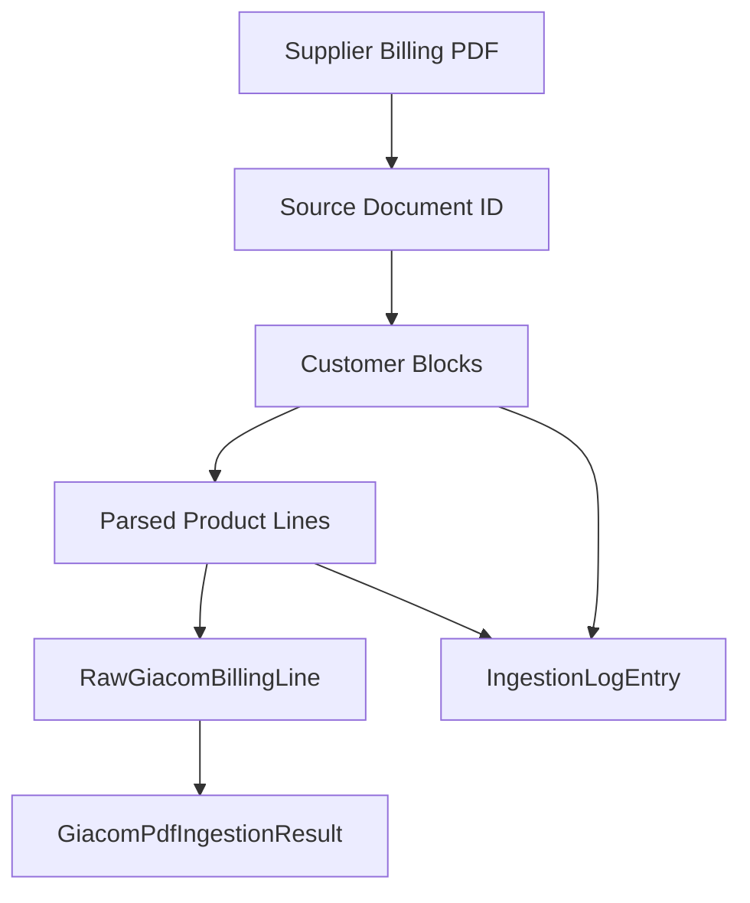

# Data Model: Giacom Supplier Billing PDF Ingestion

**Feature**: `002-giacom-pdf-ingestion`  
**Date**: 2026-07-01

This document defines pipeline-specific types for PDF ingestion. Output lines conform to existing domain type `RawGiacomBillingLine` in `BillDrift.Domain.Import` (see `001-billing-domain-model/data-model.md`).

## Type Placement

| Layer | Namespace | Types |
|-------|-----------|-------|
| Application | `BillDrift.Application.Import` | Public contract + result DTOs |
| Infrastructure | `BillDrift.Infrastructure.Import.Giacom.Internal` | Parse-stage internal types |
| Domain | `BillDrift.Domain.Import` | `RawGiacomBillingLine`, `RawImportId` (existing) |

## Application Layer (Public)

### `GiacomReportType`

```csharp
public enum GiacomReportType
{
    Unknown = 0,
    PreBilling = 1,
    PostBilling = 2
}
```

### `IngestionOutcomeStatus`

```csharp
public enum IngestionOutcomeStatus
{
    Success = 0,          // All identified lines extracted
    PartialSuccess = 1,   // Some lines/blocks skipped
    Failure = 2           // No lines extracted or document unreadable
}
```

### `IngestionLogSeverity`

```csharp
public enum IngestionLogSeverity
{
    Warning = 0,
    Error = 1
}
```

### `IngestionFailureReason`

```csharp
public enum IngestionFailureReason
{
    DocumentUnreadable,
    DocumentEncrypted,
    NoCustomerBlocksFound,
    BlockHeaderMissing,
    MexIdMissing,
    CustomerNameMissing,
    QuantityUnparseable,
    LineCostUnparseable,
    PeriodUnparseable,
    AmbiguousLineStructure,
    PageLimitExceeded,
    FileSizeExceeded
}
```

### `IngestionLocation`

```csharp
public sealed record IngestionLocation(
    int PageNumber,
    int BlockIndex,
    int? LineIndex);
```

### `IngestionLogEntry`

| Field | Type | Notes |
|-------|------|-------|
| `Severity` | `IngestionLogSeverity` | Warning or Error |
| `Reason` | `IngestionFailureReason` | Machine-readable code |
| `Message` | `string` | Operator-readable description |
| `Location` | `IngestionLocation?` | Null for document-level failures |
| `RawSnippet` | `string?` | Max 200 chars; truncated source text |
| `SourceDocumentId` | `string` | SHA-256 hex |

### `GiacomPdfIngestionSummary`

| Field | Type | Notes |
|-------|------|-------|
| `LinesExtracted` | `int` | Successfully emitted lines |
| `LinesSkipped` | `int` | Line-level skips |
| `BlocksSkipped` | `int` | Block-level skips |
| `Warnings` | `int` | Non-fatal issues (e.g., period unparseable) |
| `CustomerBlockCount` | `int` | Blocks identified |

### `GiacomPdfIngestionResult`

| Field | Type | Notes |
|-------|------|-------|
| `SourceDocumentId` | `string` | SHA-256 of PDF bytes |
| `ReportType` | `GiacomReportType` | Pre/post/unknown |
| `IngestedAt` | `DateTimeOffset` | Pipeline completion time |
| `Status` | `IngestionOutcomeStatus` | Aggregate outcome |
| `Lines` | `IReadOnlyList<RawGiacomBillingLine>` | Extracted lines |
| `LogEntries` | `IReadOnlyList<IngestionLogEntry>` | Skips and warnings |
| `Summary` | `GiacomPdfIngestionSummary` | Counts |

**Validation rules**:
- `Failure` → `Lines` is empty.
- `Success` → `LinesSkipped = 0` and `BlocksSkipped = 0`.
- Every `RawGiacomBillingLine.SourceDocumentId` equals result `SourceDocumentId`.
- Every line `ExtractedAt` equals result `IngestedAt` (single pipeline run).

## Infrastructure Internal Types

Internal types are implementation details; not referenced outside Infrastructure.

### `PdfWord`

| Field | Type | Notes |
|-------|------|-------|
| `Text` | `string` | Word text |
| `X` | `double` | Left edge |
| `Y` | `double` | Bottom edge (PdfPig coordinate space) |
| `Width` | `double` | |
| `Height` | `double` | |
| `PageNumber` | `int` | 1-based |

### `PdfTextLine`

| Field | Type | Notes |
|-------|------|-------|
| `Words` | `IReadOnlyList<PdfWord>` | Left-to-right ordered |
| `PageNumber` | `int` | |
| `BaselineY` | `double` | Average Y for grouping |
| `Text` | `string` | Concatenated word text |

### `ColumnDefinition`

| Field | Type | Notes |
|-------|------|-------|
| `Name` | `string` | Logical field name (`ProductName`, `Quantity`, etc.) |
| `MinX` | `double` | Column left bound |
| `MaxX` | `double` | Column right bound |

### `CustomerBlock`

| Field | Type | Notes |
|-------|------|-------|
| `BlockIndex` | `int` | 0-based document order |
| `PageNumber` | `int` | Page where block starts |
| `CustomerNameRaw` | `string?` | As extracted |
| `MexIdRaw` | `string?` | As extracted |
| `ProductLines` | `IReadOnlyList<ParsedProductLine>` | Parsed rows |

### `ParsedProductLine`

| Field | Type | Notes |
|-------|------|-------|
| `BlockIndex` | `int` | Parent block |
| `LineIndex` | `int` | 0-based within block |
| `PageNumber` | `int` | |
| `ProductNameRaw` | `string` | After merge |
| `QuantityRaw` | `string?` | |
| `ChargeTypeRaw` | `string?` | |
| `PeriodStartRaw` | `string?` | |
| `PeriodEndRaw` | `string?` | |
| `LineCostRaw` | `string?` | |
| `SupplierReferenceIds` | `IReadOnlyList<string>` | Ordered as on PDF |
| `IsContinuationMerged` | `bool` | True if name merged from wrap row |

## Mapping to Domain `RawGiacomBillingLine`

| Parsed / block field | `RawGiacomBillingLine` field | Rule |
|----------------------|------------------------------|------|
| `MexIdRaw` (block) | `MexIdRaw` | Trim whitespace only |
| `ProductNameRaw` | `ProductNameRaw` | No modification |
| `QuantityRaw` | `QuantityRaw` | Required for emit; skip line if null/empty |
| `ChargeTypeRaw` | `ChargeTypeRaw` | Default `"Recurring"` if empty |
| `PeriodStartRaw` | `PeriodStartRaw` | Nullable |
| `PeriodEndRaw` | `PeriodEndRaw` | Nullable |
| `LineCostRaw` | `LineCostRaw` | Required for emit |
| `SupplierReferenceIds` | `SupplierReferenceIds` | Pass through |
| Document hash | `SourceDocumentId` | SHA-256 hex |
| Line key logic | `Id` | `RawImportId.Create(GiacomBillingPdf, docId, lineKey)` |
| Pipeline time | `ExtractedAt` | UTC `DateTimeOffset` |

## Entity Relationship (Pipeline)



## State Transitions: `IngestionOutcomeStatus`

```text
Document intake
  ├─ unreadable/encrypted → Failure
  ├─ no blocks found → Failure
  └─ blocks found
       ├─ all lines extracted, no skips → Success
       └─ any line/block skip → PartialSuccess
```

Empty PDF with zero lines but valid structure (e.g., cover only) → `Success` with zero lines and informational log (spec edge case).

## Intake Validation Constants

| Constant | Default | Rationale |
|----------|---------|-----------|
| `MaxFileSizeBytes` | 20 MB | Constitution IV — bounded upload |
| `MaxPageCount` | 500 | Prevents runaway parse on corrupt files |
| `MaxLogSnippetLength` | 200 | Avoid logging full customer data |

## Related Artifacts

- [contracts/pdf-ingestion-pipeline.md](./contracts/pdf-ingestion-pipeline.md) — interface contract
- [contracts/giacom-block-grammar.md](./contracts/giacom-block-grammar.md) — segmentation rules
- [../001-billing-domain-model/data-model.md](../001-billing-domain-model/data-model.md) — domain raw import types
