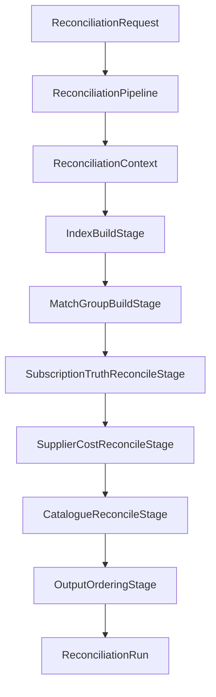

# Data Model: Reconciliation Engine (Application Layer)

**Feature**: `004-reconciliation-engine`  
**Project**: `BillDrift.Application.Reconciliation`  
**Date**: 2026-07-02

## Overview

This feature implements reconciliation **orchestration and rule logic** in the Application layer. Domain entities (`ReconciliationRun`, `EntityMatchGroup`, `Mismatch`, `ProposedChange`, and all billing inputs) are defined in `BillDrift.Domain` (feature 001) and are **not modified** unless a gap is discovered during implementation.

This document describes **Application-layer types** (pipeline internals) and how they map to domain output.



---

## Public API (unchanged from 001 contract)

| Type | Location | Role |
|------|----------|------|
| `IReconciliationEngine` | `BillDrift.Application.Reconciliation` | Entry point |
| `ReconciliationRequest` | Same | RunId, Scope, Inputs, Options |
| `ReconciliationOptions` | Same | IncludeNonCsp, IncludeInactive, PriceTolerance, ProposeCatalogueChanges |
| `ReconciliationRun` | `BillDrift.Domain.Reconciliation` | Output aggregate |

---

## Pipeline Internal Types

### `ReconciliationContext`

Mutable per-run workspace. **Not exposed publicly.**

| Field | Type | Description |
|-------|------|-------------|
| `Request` | `ReconciliationRequest` | Original request |
| `RunId` | `RunId` | Resolved run identifier |
| `Options` | `ReconciliationOptions` | Resolved options (defaults applied) |
| `IntendedPriceIndex` | `IntendedPriceIndex` | CommercialKey → winning IntendedPrice |
| `StripeCatalogueIndex` | `StripeCatalogueIndex` | Product/price lookup by ID and CommercialKey |
| `ProductMappingIndex` | `ProductMappingIndex` | Offer/SKU and name variant lookups |
| `MatchGroups` | `List<EntityMatchGroup>` | Accumulated groups (mutable during build) |
| `Mismatches` | `List<Mismatch>` | Detected issues |
| `ProposedChanges` | `List<ProposedChange>` | Corrective suggestions |

**Lifecycle**: Created at pipeline start; frozen into immutable lists on `ReconciliationRun` construction.

---

### `IntendedPriceIndex`

| Method | Returns | Rule |
|--------|---------|------|
| `TryGet(CommercialKey key, out IntendedPrice price)` | bool | Manual override > catalogue for same key |
| `GetAllKeys()` | `IReadOnlySet<CommercialKey>` | For catalogue reconciliation sweep |

**Build rules**:
1. Index all `Inputs.IntendedPrices` where `PriceListStatus != EndOfSale` (EndOfSale still indexed but flagged Info if used)
2. On duplicate `CommercialKey`: `PriceSource.ManualOverride` wins over `Catalogue`

---

### `StripeCatalogueIndex`

Built from `StripeBillingItem` collection plus embedded product/price metadata on items.

| Method | Returns | Rule |
|--------|---------|------|
| `TryGetPrice(StripePriceId id, out StripePriceSnapshot price)` | bool | Unit amount, interval, currency |
| `TryGetProduct(StripeProductId id, out StripeProductSnapshot product)` | bool | Name, metadata offer/SKU |
| `FindPrices(CommercialKeyRoot root)` | `IReadOnlyList<StripePriceSnapshot>` | Match metadata offer/SKU on product |
| `FindItems(CustomerIdentity customer, CommercialKey key)` | `IReadOnlyList<StripeBillingItem>` | Same MexId + commercial dimensions |

### `StripePriceSnapshot` / `StripeProductSnapshot`

Internal read-only views extracted during indexing — not persisted domain entities.

| Snapshot | Key fields |
|----------|------------|
| `StripePriceSnapshot` | `StripePriceId`, `StripeProductId`, `UnitAmount`, `Interval`, `Currency` |
| `StripeProductSnapshot` | `StripeProductId`, `Name`, `OfferId?`, `SkuId?` |

---

### `ProductMappingIndex`

| Method | Returns | Rule |
|--------|---------|------|
| `TryGetByRoot(CommercialKeyRoot root, out ProductMapping mapping)` | bool | Unique mapping required |
| `FindByNameVariant(string supplierName)` | `IReadOnlyList<ProductMapping>` | Delegates to `IProductMappingResolver` |
| `FindFuzzyCandidates(string supplierName)` | `IReadOnlyList<ProductMapping>` | Deterministic fuzzy scorer |

---

### `CommercialKeyResolution`

Result of product identity resolution for a source line.

| Field | Type | Description |
|-------|------|-------------|
| `CommercialKeyRoot` | `CommercialKeyRoot?` | Resolved offer/SKU |
| `CommercialKey` | `CommercialKey?` | Full key including term/frequency when known |
| `Confidence` | `MatchConfidence` | High / Medium / Low / None |
| `ResolutionPath` | `ProductResolutionPath` | Audit trail enum |
| `Mapping` | `ProductMapping?` | Mapping used, if any |

### `ProductResolutionPath` (enum)

| Value | Meaning |
|-------|---------|
| `ExplicitOfferSku` | Offer/SKU on source line |
| `StripeMetadata` | From Stripe product metadata |
| `MappingByRoot` | ProductMapping lookup by offer/SKU |
| `NameVariantExact` | Exact supplier name variant match |
| `NameFuzzy` | Deterministic fuzzy fallback |
| `Unresolved` | No resolution |

---

## Domain Output Mapping

### Reconciliation Result (spec) → `EntityMatchGroup` (domain)

| Spec concept | Domain field |
|--------------|--------------|
| Customer | `EntityMatchGroup.Customer` |
| Product | `EntityMatchGroup.CommercialKey` |
| Stripe item | `EntityMatchGroup.StripeItem` |
| Truth item | `EntityMatchGroup.SubscriptionLine` |
| Supplier cost line(s) | `EntityMatchGroup.SupplierCostLine` (single primary; additional lines referenced via mismatch entity refs when multiple) |
| Pricing reference | `EntityMatchGroup.IntendedPrice` |
| Match status | Derived from `EntityMatchGroup.Confidence` + linked mismatches |
| Issues | `Mismatch` records referencing `MatchGroupId` |
| Proposed actions | `ProposedChange` records linked via `MismatchId` |

**Note**: When multiple supplier cost lines attach to one group, primary line is the recurring charge; pro-rata lines referenced in `MismatchEntityRefs` for audit.

---

## Match Group Key

Internal grouping key used during build (not a domain type):

```text
MatchGroupKey = (MexId, CommercialKeyRoot, Term?, BillingFrequency?)
```

- Subscription truth lines always supply full `CommercialKey`
- Supplier-only orphan groups may have `CommercialKeyRoot` only with `Confidence = Low`

---

## Mismatch Emission Rules (summary)

Full rules in [contracts/mismatch-rules.md](./contracts/mismatch-rules.md).

| Condition | MismatchType | ProposedAction? |
|-----------|--------------|-----------------|
| Unresolved product | `MappingMissing` | No |
| Multiple Stripe or mapping candidates | `MappingAmbiguous` | No |
| Non-CSP line (default options) | `MappingMissing` (annotated) | No |
| Active truth, no Stripe item | `MissingInStripe` | `CreateMissingItem` |
| Quantity differs | `QuantityMismatch` | `UpdateQuantity` |
| Wrong price interval | `BillingFrequencyMismatch` | `SwitchPrice` if target exists |
| Wrong unit amount | `PriceMismatch` | `SwitchPrice` if target exists |
| Mapping exists, Stripe price ID absent | `CatalogueMissing` | `CreateOrUpdateCatalogueEntry` if enabled |

---

## Validation Rules

| Rule | Applies to |
|------|------------|
| `ReconciliationRequest.Scope.End >= Scope.Start` | Input validation stage |
| At least one of subscription lines or stripe items non-empty | Warning if both empty (valid but no-op) |
| `MexId` required on all customer-scoped lines | Skip or mapping-missing if absent |
| Low-confidence-only match | No bill-impacting proposed actions |
| Deterministic ordering | `(MexId, CommercialKey, MismatchType)` |
| Idempotency key format | `{RunId}:{MismatchId}:{ActionType}` |

---

## Project Folder Layout (new files)

```text
src/BillDrift.Application/Reconciliation/
├── ReconciliationEngine.cs
├── ReconciliationPipeline.cs
├── ReconciliationContext.cs
├── Stages/
│   ├── InputValidationStage.cs
│   ├── IndexBuildStage.cs
│   ├── MatchGroupBuildStage.cs
│   ├── SubscriptionTruthReconcileStage.cs
│   ├── SupplierCostReconcileStage.cs
│   ├── CatalogueReconcileStage.cs
│   └── OutputOrderingStage.cs
├── Matching/
│   ├── CommercialKeyResolver.cs
│   ├── CustomerMatcher.cs
│   ├── StripeItemMatcher.cs
│   ├── DeterministicFuzzyNameMatcher.cs
│   └── ProductResolutionPath.cs
├── Detection/
│   ├── MismatchDetector.cs
│   └── ProposedChangeFactory.cs
└── Indexing/
    ├── IntendedPriceIndex.cs
    ├── StripeCatalogueIndex.cs
    ├── ProductMappingIndex.cs
    ├── StripePriceSnapshot.cs
    └── StripeProductSnapshot.cs
```

---

## Relationship to Feature 001 Domain Model

| 001 entity | Modified? | Notes |
|------------|-----------|-------|
| `ReconciliationRun` | No | Consumed as output |
| `EntityMatchGroup` | No | Populated by engine |
| `Mismatch` | No | Created by detector |
| `ProposedChange` | No | Created by factory |
| `MismatchType` enum | No | Non-CSP uses `MappingMissing` + description |
| `ReconciliationInputs` | No | Input snapshot |

If implementation discovers `ReconciliationInputs` lacks Stripe catalogue products/prices separate from billing items, extend inputs in a minimal follow-up PR — prefer extracting catalogue data from billing items + optional catalogue list on inputs.
