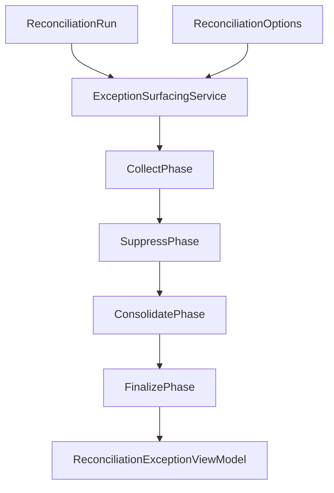

# Data Model: Reconciliation Exception Surfacing (Application Layer)

**Feature**: `005-reconciliation-exceptions`  
**Project**: `BillDrift.Application.Reconciliation.ExceptionSurfacing`  
**Date**: 2026-07-02

## Overview

This feature implements a **presentation layer** over `ReconciliationRun` output. It does not modify Domain entities from feature 001. All types below live in `BillDrift.Application.Reconciliation.ExceptionSurfacing` unless noted.



---

## Public API

| Type | Role |
|------|------|
| `ExceptionSurfacingService` | Entry point — `Surface(run, options?)` |
| `ReconciliationExceptionViewModel` | Top-level output |
| `ExceptionRunSummary` | Run-level statistics |
| `CustomerExceptionGroup` | Per-customer bucket |
| `SurfacedException` | Single operator-facing exception |
| `ExceptionEvidence` | One labelled evidence datum |

**Input**: `ReconciliationRun` + optional `ReconciliationOptions` (for scope-aware derived detection).  
**Output**: Immutable view model graph; safe to serialize to JSON for API/UI.

---

## View Model Types

### `ReconciliationExceptionViewModel`

| Field | Type | Description |
|-------|------|-------------|
| `RunId` | `RunId` | From reconciliation run |
| `Scope` | `BillingPeriod` | Run scope |
| `GeneratedAt` | `DateTimeOffset` | Surfacing timestamp (excluded from determinism comparisons) |
| `Summary` | `ExceptionRunSummary` | Aggregate counts |
| `CustomerGroups` | `IReadOnlyList<CustomerExceptionGroup>` | Ordered customer buckets |
| `HasExceptions` | `bool` | Convenience flag (`TotalCount > 0`) |

**Derived**: `FlatExceptions()` → deterministic flat list from group order + within-group order (spec US5).

---

### `ExceptionRunSummary`

| Field | Type |
|-------|------|
| `TotalCount` | `int` |
| `BySeverity` | `IReadOnlyDictionary<ExceptionSeverity, int>` |
| `ByCategory` | `IReadOnlyDictionary<ExceptionCategory, int>` |
| `ByDomain` | `IReadOnlyDictionary<ReconciliationDomain, int>` |
| `CustomersAffected` | `int` |
| `RequiresActionNowCount` | `int` |
| `SuppressedCount` | `int` | Audit — candidates removed by suppression |

---

### `CustomerExceptionGroup`

| Field | Type |
|-------|------|
| `Customer` | `CustomerIdentity` |
| `DisplayLabel` | `string` | `DisplayName` if present, else `MexId` |
| `HighestSeverity` | `ExceptionSeverity` |
| `BySeverity` | `IReadOnlyDictionary<ExceptionSeverity, int>` |
| `RequiresActionNowCount` | `int` |
| `Exceptions` | `IReadOnlyList<SurfacedException>` | Ordered per contract |

---

### `SurfacedException`

| Field | Type | Description |
|-------|------|-------------|
| `Id` | `SurfacedExceptionId` | Stable deterministic identifier |
| `Category` | `ExceptionCategory` | Primary operator workflow category |
| `Domain` | `ReconciliationDomain` | Which comparison domain |
| `Severity` | `ExceptionSeverity` | Info / Warning / Error |
| `Customer` | `CustomerIdentity` | Required |
| `Product` | `ProductContext?` | Commercial key + display label when known |
| `Explanation` | `string` | Plain-language operator text |
| `Evidence` | `IReadOnlyList<ExceptionEvidence>` | Supporting data |
| `RequiresActionNow` | `bool` | Triage flag |
| `ProposedChangeId` | `ProposedChangeId?` | Present only when eligible and not blocked |
| `SuppressedSiblingCount` | `int` | How many raw mismatches this exception replaced |
| `SourceMismatchIds` | `IReadOnlyList<MismatchId>` | Traceability to engine output |

---

### `ProductContext`

| Field | Type |
|-------|------|
| `CommercialKey` | `CommercialKey?` |
| `DisplayLabel` | `string` | e.g., `"Microsoft 365 Business Standard (offer/sku)"` |
| `OfferId` | `OfferId?` |
| `SkuId` | `SkuId?` |

---

### `ExceptionEvidence`

| Field | Type | Description |
|-------|------|-------------|
| `Source` | `EvidenceSource` | Enum — which data domain |
| `Field` | `string` | e.g., `"Licence Count"`, `"Unit Amount"` |
| `Value` | `string` | Human-readable formatted value |
| `EntityRef` | `string?` | Optional domain entity ID for drill-down |

---

### `SurfacedExceptionId`

```csharp
public readonly record struct SurfacedExceptionId(string Value);
// Format: "{RunId}:m:{MismatchId}" or "{RunId}:d:{RuleCode}:{EntityRef}"
```

---

## Enumerations

### `ExceptionCategory`

| Value | Operator label |
|-------|----------------|
| `MissingBillingItem` | Missing Billing Item |
| `OrphanedBillingItem` | Orphaned Billing Item |
| `QuantityLicenceMismatch` | Quantity or Licence Mismatch |
| `BillingFrequencyMismatch` | Billing Frequency Mismatch |
| `ProductMismatch` | Product Mismatch |
| `StripeProductMissing` | Stripe Product Missing |
| `StripePriceMissing` | Stripe Price Missing |
| `StripePriceRrpMismatch` | Stripe Price Does Not Match Intended RRP |
| `OfferSkuAmbiguousMapping` | Offer or SKU Ambiguous Mapping |
| `MexIdMismatch` | Mex ID Mismatch |
| `NonCspManualReview` | Non-CSP Requires Manual Review |

### `ReconciliationDomain`

| Value |
|-------|
| `TruthVsStripe` |
| `SupplierCostVsMapping` |
| `PricingVsCatalogue` |

### `ExceptionSeverity`

Aligned with `MismatchSeverity`: `Info`, `Warning`, `Error`.

### `EvidenceSource`

| Value | Maps from |
|-------|-----------|
| `SubscriptionTruth` | `MicrosoftSubscriptionLine` |
| `StripeSubscriptionItem` | `StripeBillingItem` |
| `SupplierCostLine` | `SupplierCostLine` |
| `IntendedRetailPrice` | `IntendedPrice` |
| `StripeCatalogue` | Catalogue snapshots |
| `ProductMapping` | `ProductMapping` |

---

## Pipeline Internal Types

### `SurfacingContext`

Mutable workspace per `Surface` call.

| Field | Type |
|-------|------|
| `Run` | `ReconciliationRun` |
| `Options` | `ReconciliationOptions` |
| `MatchGroupById` | `Dictionary<MatchGroupId, EntityMatchGroup>` |
| `MismatchById` | `Dictionary<MismatchId, Mismatch>` |
| `ProposedChangeByMismatchId` | `Dictionary<MismatchId, ProposedChange>` |
| `Candidates` | `List<SurfacedException>` |
| `Suppressed` | `List<SuppressionRecord>` | Audit trail |

### `SuppressionRecord`

| Field | Type |
|-------|------|
| `MismatchId` | `MismatchId?` |
| `Rule` | `SuppressionRule` |
| `Reason` | `string` |

### `SuppressionRule` (enum)

| Value | Effect |
|-------|--------|
| `RootCauseMapping` | Mapping issue blocks dependent billing mismatches |
| `RootCauseMexId` | Identity conflict blocks truth-vs-Stripe alignment |
| `LowConfidence` | Bill-impacting proposed action stripped |
| `CatalogueSubsumedBySubscription` | Subscription price exception covers catalogue delta |
| `OutOfScopeInactive` | Canceled/inactive Stripe item excluded |

---

## Derived Detectors

| Detector | Input | Output category |
|----------|-------|-----------------|
| `OrphanedStripeDetector` | Unmatched in-scope `StripeBillingItem`s | `OrphanedBillingItem` |
| `MexIdMismatchDetector` | Cross-source MexId on same match group / Stripe customer | `MexIdMismatch` |
| `ProductMismatchDetector` | Truth vs Stripe commercial key conflict on joined group | `ProductMismatch` |

Each detector emits `SurfacedException` candidates with `SourceMismatchIds` empty and `Id` using `Derived` format.

---

## Domain Input Mapping (unchanged types)

| 001 Domain type | Surfacing usage |
|-----------------|-----------------|
| `ReconciliationRun` | Primary input |
| `EntityMatchGroup` | Evidence extraction, match group scoping, orphaned detection |
| `Mismatch` | Primary exception source |
| `ProposedChange` | Optional `ProposedChangeId` link |
| `MismatchType` | Mapped via `MismatchToExceptionMapper` |
| `MatchConfidence` | Low/None → strip proposed action eligibility |

**No schema changes** to Domain types in this feature.

---

## Validation Rules

| Rule | Applies to |
|------|------------|
| `Explanation` non-empty | Every `SurfacedException` |
| At least one evidence item when multiple sources exist | FR-019 / SC-003 |
| `Customer.MexId` required on every exception | FR-007 |
| `ProposedChangeId` only when proposed change exists and guards pass | FR-013, FR-020 |
| Deterministic ordering independent of `GeneratedAt` | FR-022 |
| No secrets in evidence values | FR-019 / constitution IV |
| `SuppressedSiblingCount` ≥ 0 | Audit integrity |

---

## Project Folder Layout

```text
src/BillDrift.Application/Reconciliation/ExceptionSurfacing/
├── ExceptionSurfacingService.cs          # ★ Entry point
├── ReconciliationExceptionViewModel.cs   # ★ Output records + enums
├── SurfacingContext.cs
├── Phases/
│   ├── CollectPhase.cs
│   ├── SuppressPhase.cs
│   ├── ConsolidatePhase.cs
│   └── FinalizePhase.cs
├── Mapping/
│   └── MismatchToExceptionMapper.cs
├── Detection/
│   ├── OrphanedStripeDetector.cs
│   ├── MexIdMismatchDetector.cs
│   └── ProductMismatchDetector.cs
├── Evidence/
│   └── EvidenceBuilder.cs
└── Ordering/
    └── ExceptionOrdering.cs

tests/BillDrift.Application.Tests/ExceptionSurfacing/
├── ExceptionSurfacingServiceTests.cs
├── SuppressionRulesTests.cs
├── MismatchMappingTests.cs
├── DerivedDetectorTests.cs
├── ConsolidationTests.cs
├── OrderingTests.cs
└── DeterminismTests.cs

tests/fixtures/exception-surfacing/
├── mixed-three-customers.json
├── suppression-mapping-root-cause.json
├── catalogue-consolidation.json
├── orphaned-stripe-item.json
├── mex-id-mismatch.json
├── low-confidence-no-action.json
└── clean-run-empty.json
```
