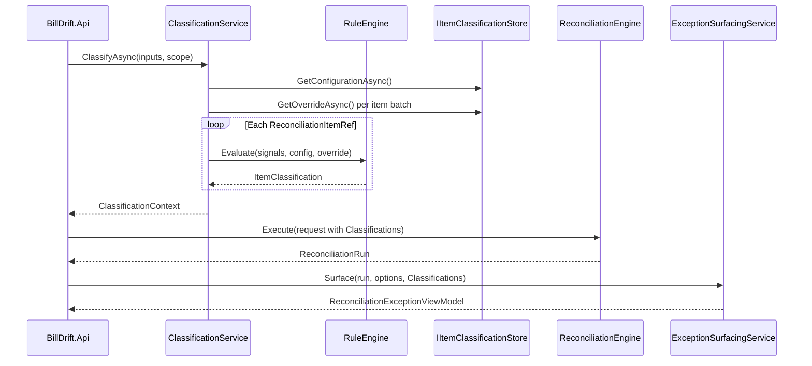

# Contract: Classification Pipeline

**Feature**: `006-reconciliation-classification`  
**Consumer**: `BillDrift.Application`, `BillDrift.Api`  
**Date**: 2026-07-02

## Purpose

Define the end-to-end classification pipeline that runs before reconciliation matching and supplies `ClassificationContext` to the engine and exception surfacing layers.

## Pipeline Stages



## Stage 1 — Extract Item Refs

From `ReconciliationInputs`, enumerate:

| Source collection | `ReconciliationItemKind` |
|-------------------|--------------------------|
| `SupplierCostLines` | `SupplierCost` |
| `SubscriptionLines` | `SubscriptionTruth` |
| `StripeItems` | `StripeBilling` |

Skip out-of-scope period lines per `BillingPeriod` scope (same rules as reconciliation engine).

## Stage 2 — Load Persistence

1. Load `ClassificationRuleConfiguration`
2. Batch-load active overrides for extracted `StableKey` values (point lookups or partition scan — implementation may cache per run)

## Stage 3 — Build Signal Context

Per item, compute signal bundle:

| Signal | Used by rules |
|--------|---------------|
| `CustomerMexId` | Internal customer |
| `HasOfferSku` | CSP |
| `InSubscriptionTruth` | CSP / Non-CSP |
| `InIntendedPriceList` | CSP |
| `HasSupplierCostEvidence` | Non-CSP |
| `HasStripeBillingOnly` | Custom/service |
| `ProductCategory` | CSP / Custom/service |
| `ProductMappingHint` | Tie-breaker only |

`InSubscriptionTruth` correlation: same `MexId` and (`CommercialKeyRoot` match OR supplier product name maps to same mapping).

## Stage 4 — Apply Rule Chain

See [classification-rules.md](./classification-rules.md). Output `ItemClassification` per ref.

## Stage 5 — Attach to Reconciliation

`ReconciliationRequest` gains optional `ClassificationContext? Classifications`.

If null (tests / legacy): engine falls back to `ProductMapping.Classification` only.

## Stage 6 — Exception Surfacing Input

`ExceptionSurfacingService.Surface` overload or `SurfacingContext` accepts `ClassificationContext?` for SR-6 internal suppression.

## Determinism Contract

Given identical:
- `ReconciliationInputs` snapshot
- `ClassificationRuleConfiguration`
- Override store state
- `BillingPeriod` scope

Then `ClassificationContext.ByStableKey` MUST be identical (excluding `ClassifiedAt` timestamp in equality comparisons).

## Error Handling

| Condition | Behaviour |
|-----------|-----------|
| Store unavailable | Fail reconciliation start with operator-facing error (do not silently skip classification) |
| Invalid override in store | Log warning, ignore override, apply automatic rules |
| Unclassifiable item (no signals) | `NonCspSupplier` + `Low` confidence + rule basis `"NoSignals"` |

## Registration (Aspire / DI)

```
Infrastructure:
  AddClassificationStorage() → IItemClassificationStore, TableServiceClient from Aspire

Application:
  AddClassification() → ClassificationService, ClassificationRuleEngine

Api:
  MapClassificationEndpoints()
```

No manual `TableServiceClient` construction outside Infrastructure registration.
