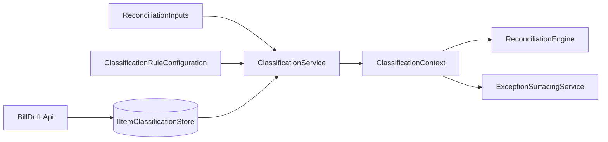

# Data Model: Reconciliation Item Classification

**Feature**: `006-reconciliation-classification`  
**Projects**: `BillDrift.Domain`, `BillDrift.Application.Classification`, `BillDrift.Infrastructure.Classification`  
**Date**: 2026-07-02

## Overview

Classification adds **per-item origin typing** that drives reconciliation guards and exception suppression. Domain types are authoritative billing concepts; Application owns the rule engine; Infrastructure persists to Azure Tables via Aspire-injected `TableServiceClient`.

---

## Domain Types (`BillDrift.Domain.Classification`)

### `ReconciliationItemClassification` (enum)

| Value | Meaning |
|-------|---------|
| `MicrosoftCsp` | Offer/SKU-based Microsoft CSP line in truth and/or price list |
| `NonCspSupplier` | Supplier-billed item not in subscription management truth |
| `Internal` | Not billed to external customers (own company / internal Mex ID) |
| `CustomService` | Billing independent of supplier cost and subscription truth |

### `ClassificationSource` (enum)

| Value | Meaning |
|-------|---------|
| `Automatic` | Rule engine assignment |
| `ManualOverride` | Operator override from store |

### `ClassificationConfidence` (enum)

| Value | Meaning |
|-------|---------|
| `High` | All required signals present, no tier conflict |
| `Medium` | Signals present with minor ambiguity |
| `Low` | Conservative default or conflicting same-tier signals |

### `ReconciliationItemKind` (enum)

`SupplierCost`, `SubscriptionTruth`, `StripeBilling`

### `ReconciliationItemRef` (readonly record struct)

| Field | Type | Description |
|-------|------|-------------|
| `Kind` | `ReconciliationItemKind` | Which normalized entity |
| `StableKey` | `string` | Deterministic business key for persistence |
| `EntityId` | `Guid?` | In-run domain entity ID (optional) |
| `CustomerMexId` | `MexId` | Owning customer |

**Factory methods**: `FromSupplierCostLine`, `FromSubscriptionLine`, `FromStripeBillingItem` — compute `StableKey` per research R2.

**Validation**: `StableKey` non-empty, max 1024 chars (Table row key limit with encoding).

### `ItemClassification` (sealed record)

| Field | Type | Description |
|-------|------|-------------|
| `ItemRef` | `ReconciliationItemRef` | Item identity |
| `Classification` | `ReconciliationItemClassification` | Assigned type |
| `Source` | `ClassificationSource` | Automatic or override |
| `RuleBasis` | `string` | Human-readable signals (e.g. `"InternalMexId:MEX123"`) |
| `Confidence` | `ClassificationConfidence` | Rule confidence |
| `OverrideNotes` | `string?` | Present when `Source == ManualOverride` |
| `ClassifiedAt` | `DateTimeOffset` | Last assignment time |
| `OperatorId` | `string?` | Who set override (null for automatic) |

### `ClassificationOverride` (sealed record)

| Field | Type | Description |
|-------|------|-------------|
| `ItemRef` | `ReconciliationItemRef` | Target item |
| `Classification` | `ReconciliationItemClassification` | Override value |
| `Notes` | `string` | Required when suppressing alerts (Internal/CustomService) |
| `OperatorId` | `string` | Actor identity |
| `CreatedAt` | `DateTimeOffset` | When applied |

### `ClassificationHistoryEntry` (sealed record)

| Field | Type |
|-------|------|
| `ItemRef` | `ReconciliationItemRef` |
| `PriorClassification` | `ReconciliationItemClassification?` |
| `NewClassification` | `ReconciliationItemClassification` |
| `Source` | `ClassificationSource` |
| `Notes` | `string?` |
| `OperatorId` | `string?` |
| `Timestamp` | `DateTimeOffset` |

### `ProductCategory` (enum)

| Value | Meaning |
|-------|---------|
| `Microsoft365` | Microsoft 365 / Office 365 family |
| `Other` | Default when no rule matches |
| `CustomService` | Professional services, one-off fees |

### `ProductCategoryRule` (sealed record)

| Field | Type | Description |
|-------|------|-------------|
| `MatchPattern` | `string` | Offer ID prefix, SKU pattern, or normalized name variant |
| `MatchKind` | `ProductCategoryMatchKind` | `OfferIdPrefix`, `SkuIdPrefix`, `ProductNameContains` |
| `Category` | `ProductCategory` | Assigned category |

### `ClassificationRuleConfiguration` (sealed record)

| Field | Type | Description |
|-------|------|-------------|
| `InternalMexIds` | `IReadOnlyList<MexId>` | Customers treated as internal |
| `ProductCategoryRules` | `IReadOnlyList<ProductCategoryRule>` | Category inference rules |
| `RequireNotesForAlertSuppression` | `bool` | Default `true` (FR-008) |

**Defaults**: empty internal list, empty rules, `RequireNotesForAlertSuppression = true`.

---

## Application Types (`BillDrift.Application.Classification`)

### `ClassificationService`

| Method | Returns | Description |
|--------|---------|-------------|
| `ClassifyAsync(ReconciliationInputs inputs, BillingPeriod scope, CancellationToken ct)` | `ClassificationContext` | Classify all items in inputs |
| `ApplyOverrideAsync(ClassificationOverride override, CancellationToken ct)` | `ItemClassification` | Persist override + history |
| `ClearOverrideAsync(ReconciliationItemRef itemRef, string operatorId, CancellationToken ct)` | `ItemClassification` | Remove override, re-run automatic |
| `GetConfigurationAsync(CancellationToken ct)` | `ClassificationRuleConfiguration` | Load config from store |
| `UpdateConfigurationAsync(ClassificationRuleConfiguration config, CancellationToken ct)` | `void` | Persist config |

### `ClassificationContext` (sealed record)

| Field | Type |
|-------|------|
| `ByStableKey` | `IReadOnlyDictionary<string, ItemClassification>` |
| `ClassifiedAt` | `DateTimeOffset` |

**Methods**: `Get(ReconciliationItemRef ref)`, `TryGet(string stableKey, out ItemClassification?)`

### `ClassificationRuleEngine` (internal sealed class)

Pure function: `(item signals, config, optional override) → ItemClassification`  
No I/O. Invoked by `ClassificationService` for each extracted item ref.

### `IItemClassificationStore` (interface — Infrastructure boundary)

| Method | Description |
|--------|-------------|
| `GetOverrideAsync(ReconciliationItemRef, ct)` | Active override if any |
| `SaveOverrideAsync(ClassificationOverride, ct)` | Upsert override + append history |
| `ClearOverrideAsync(ReconciliationItemRef, ct)` | Delete override row |
| `GetConfigurationAsync(ct)` | Load config entities |
| `SaveConfigurationAsync(ClassificationRuleConfiguration, ct)` | Upsert config |
| `GetHistoryAsync(ReconciliationItemRef, int limit, ct)` | Recent history entries |

**Testing**: `InMemoryItemClassificationStore` concrete class in test project (no interface-only mocks).

---

## Infrastructure (`BillDrift.Infrastructure.Classification`)

### `AzureTableItemClassificationStore`

- Injects `TableServiceClient` via constructor (Aspire registration)
- Table name from `IOptions<ClassificationStorageOptions>` (default `itemclassifications`)
- Entity mapping per [contracts/azure-table-schema.md](./contracts/azure-table-schema.md)

### `ClassificationStorageOptions`

| Property | Default |
|----------|---------|
| `TableName` | `itemclassifications` |
| `ConfigBlobContainer` | `classification-config` (optional export snapshots) |

Blob client injected for optional full-config JSON backup only; operational reads/writes use Tables.

---

## Reconciliation Integration

### `ReconciliationContext` extension

Add optional `ClassificationContext? Classifications` set by `ClassificationEnrichmentStage` before match group build.

### `EntityMatchGroup` extension (optional metadata)

Add `IReadOnlyDictionary<ReconciliationItemKind, ItemClassification>? ItemClassifications` for surfacing evidence, OR surfacing resolves via `ClassificationContext` + attached entity refs.

**Decision**: Prefer `ClassificationContext` on run/surfacing input to avoid mutating domain `EntityMatchGroup` schema — attach classifications in `SurfacingContext` keyed by `MatchGroupId` + item refs.

### Engine guard summary

| Classification | `MissingInStripe` | CSP auto-match | Bill-impacting proposals |
|----------------|-------------------|----------------|--------------------------|
| `MicrosoftCsp` | Normal | Allowed | Normal rules |
| `NonCspSupplier` | N/A (supplier-driven) | Blocked | Blocked without mapping |
| `Internal` | **Suppressed** | Allowed if matched | Normal when matched |
| `CustomService` | **Suppressed** (truth absence) | Limited | No catalogue auto-fix |

---

## Azure Table Entities (summary)

See [contracts/azure-table-schema.md](./contracts/azure-table-schema.md) for full field mapping.

---

## Validation Rules

- Override to `Internal` or `CustomService` requires non-empty `Notes` when `RequireNotesForAlertSuppression` is true
- `StableKey` must be URL-safe (Table `RowKey` encoding helper)
- `InternalMexIds` entries must be valid non-empty `MexId` values
- History entries are append-only; no in-place mutation
- Classification re-evaluation on each run for non-overridden items (FR-020)
