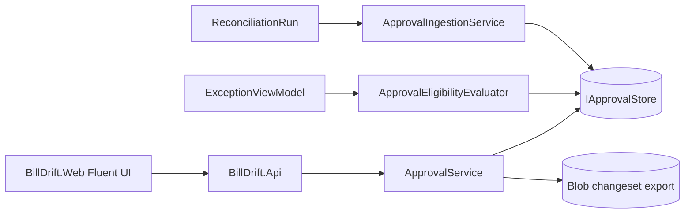
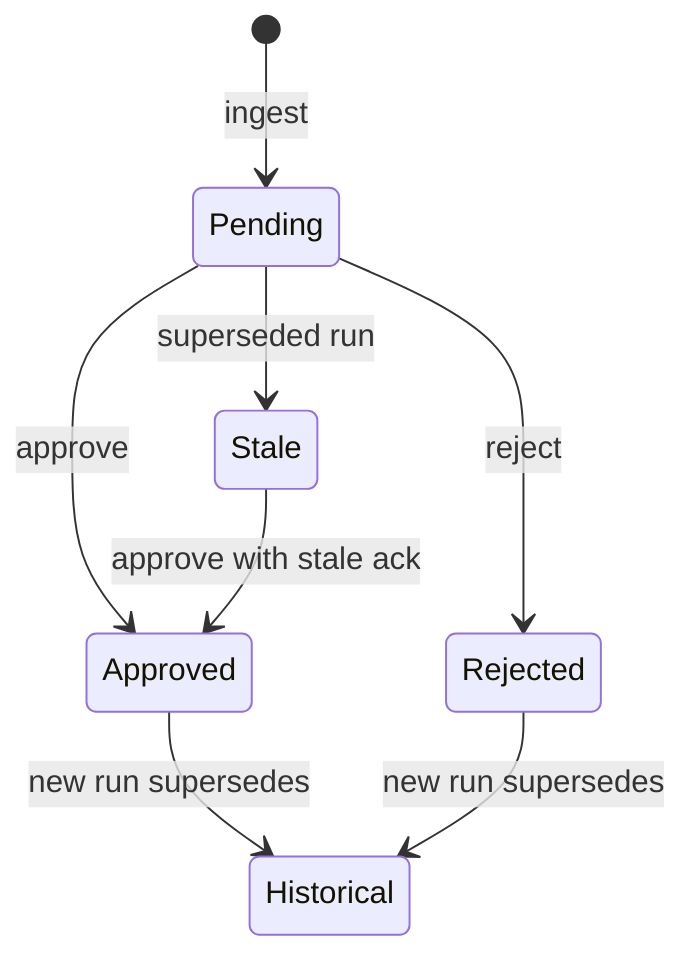

# Data Model: Reconciliation Change Approval Workflow

**Feature**: `007-reconciliation-approval-workflow`  
**Projects**: `BillDrift.Domain.Approval`, `BillDrift.Application.Approval`, `BillDrift.Infrastructure.Approval`, `BillDrift.Api`, `BillDrift.Web`  
**Date**: 2026-07-02

## Overview

The approval workflow persists human decisions on reconciliation proposals, produces auditable export artifacts, and exposes operator UI. Domain types are authoritative; Application owns ingestion, eligibility, and export; Infrastructure persists to Azure Tables/Blobs via Aspire-injected clients.

---

## Domain Types (`BillDrift.Domain.Approval`)

### `ApprovalDecisionState` (enum)

| Value | Meaning |
|-------|---------|
| `Pending` | Awaiting operator decision |
| `Approved` | Operator approved; eligible for export |
| `Rejected` | Operator rejected with reason |
| `Stale` | Superseded pending item from prior run; requires acknowledgment to approve |
| `Historical` | Prior approved/rejected item replaced by newer run proposal |

### `ApprovalEligibility` (enum)

| Value | Meaning |
|-------|---------|
| `Eligible` | May be approved/rejected for bill-impacting export |
| `InvestigationOnly` | Display-only; no export as corrective action |
| `CatalogueConflict` | Duplicate/conflict flag; manual cleanup only |
| `DependencyBlocked` | Blocked until prerequisite proposal approved (e.g. catalogue before subscription) |

### `ApprovalProposalCategory` (enum)

| Value | Maps from |
|-------|-----------|
| `Subscription` | `CreateMissingItem`, `UpdateQuantity`, `SwitchPrice` |
| `Catalogue` | `CreateOrUpdateCatalogueEntry` |
| `Investigation` | No actionable `ProposedActionType` or eligibility block |

### `ApprovalProposal` (sealed record)

| Field | Type | Description |
|-------|------|-------------|
| `Id` | `ApprovalProposalId` | Surrogate ID (GUID) |
| `RunId` | `RunId` | Source reconciliation run |
| `ProposedChangeId` | `ProposedChangeId?` | Link to engine proposal; null for investigation-only |
| `IdempotencyKey` | `IdempotencyKey` | Stable key for supersession |
| `MismatchId` | `MismatchId?` | Source mismatch |
| `Category` | `ApprovalProposalCategory` | Subscription / Catalogue / Investigation |
| `ActionType` | `ProposedActionType?` | Null for investigation-only |
| `State` | `ApprovalDecisionState` | Current decision state |
| `Eligibility` | `ApprovalEligibility` | Whether approve/export allowed |
| `EligibilityReason` | `string?` | Human-readable block reason |
| `CustomerMexId` | `MexId` | Customer grouping key |
| `ProductLabel` | `string` | Operator-facing product name |
| `CommercialKeyRoot` | `CommercialKeyRoot?` | Product identity when known |
| `PriorValues` | `IReadOnlyDictionary<string, string>` | Current/truth-side snapshot |
| `ProposedValues` | `IReadOnlyDictionary<string, string>` | Proposed Stripe-side values |
| `ExecutionOrder` | `int` | From `ProposedChange`; export ordering |
| `DependsOnProposalIds` | `IReadOnlyList<ApprovalProposalId>` | Dependency hints |
| `RiskIndicator` | `ApprovalRiskIndicator?` | e.g. revenue reduction flag |
| `IngestedAt` | `DateTimeOffset` | When proposal entered queue |
| `SupersededByRunId` | `RunId?` | Set when marked Stale/Historical |

### `ApprovalDecision` (sealed record)

| Field | Type | Description |
|-------|------|-------------|
| `ProposalId` | `ApprovalProposalId` | Target proposal |
| `RunId` | `RunId` | Run context |
| `PriorState` | `ApprovalDecisionState` | State before decision |
| `NewState` | `ApprovalDecisionState` | `Approved` or `Rejected` |
| `OperatorId` | `string` | Who decided |
| `DecidedAt` | `DateTimeOffset` | UTC timestamp |
| `RejectionReason` | `string?` | Required when `NewState == Rejected` |
| `AcknowledgedStale` | `bool` | True when approving a Stale proposal after explicit ack |

### `ApprovalAuditEventType` (enum)

`Decision`, `BulkDecision`, `Export`, `Supersession`, `Ingest`

### `ApprovalAuditEvent` (sealed record)

| Field | Type | Description |
|-------|------|-------------|
| `EventId` | `Guid` | Unique event |
| `EventType` | `ApprovalAuditEventType` | Event classification |
| `RunId` | `RunId` | Run context |
| `ProposalId` | `ApprovalProposalId?` | Related proposal |
| `OperatorId` | `string?` | Actor |
| `Timestamp` | `DateTimeOffset` | Event time |
| `Summary` | `string` | Operator-readable summary |
| `PayloadJson` | `string?` | Prior/new values snapshot |

### `ApprovedChangeset` (sealed record)

| Field | Type | Description |
|-------|------|-------------|
| `ExportId` | `Guid` | Export identifier |
| `RunId` | `RunId` | Source run |
| `ExportedAt` | `DateTimeOffset` | Export timestamp |
| `ExportedBy` | `string` | Operator |
| `Entries` | `IReadOnlyList<ApprovedChangesetEntry>` | Ordered approved actions |
| `BlobUri` | `string?` | Persisted blob location |

### `ApprovedChangesetEntry` (sealed record)

| Field | Type | Description |
|-------|------|-------------|
| `ProposalId` | `ApprovalProposalId` | Source approval |
| `IdempotencyKey` | `IdempotencyKey` | Downstream apply key |
| `ActionType` | `ProposedActionType` | Stripe action type |
| `CustomerMexId` | `MexId` | Customer |
| `ProductLabel` | `string` | Product |
| `PriorValues` | `IReadOnlyDictionary<string, string>` | Before |
| `ProposedValues` | `IReadOnlyDictionary<string, string>` | After |
| `ApprovedAt` | `DateTimeOffset` | Approval timestamp |
| `ApprovedBy` | `string` | Approver |
| `ExecutionOrder` | `int` | Apply sequence |

### `ApprovalRiskIndicator` (enum)

`None`, `RevenueReduction`, `CatalogueWideImpact`

---

## Application Types (`BillDrift.Application.Approval`)

### `IApprovalStore`

| Method | Description |
|--------|-------------|
| `UpsertProposalAsync` | Create/update proposal state |
| `GetProposalAsync` | By run + proposal id |
| `ListProposalsByRunAsync` | All proposals for run |
| `ListProposalsByCustomerAsync` | Filter by MexId |
| `AppendDecisionAsync` | Immutable decision row |
| `AppendAuditEventAsync` | Audit trail |
| `ListAuditEventsAsync` | Query by run/proposal |
| `SaveExportMetadataAsync` | Export index row |

### `ApprovalIngestionRequest`

| Field | Type |
|-------|------|
| `Run` | `ReconciliationRun` |
| `Exceptions` | `ReconciliationExceptionViewModel` |
| `Classifications` | `ClassificationContext?` |

### `ApprovalQueueViewModel` (UI/API DTO)

| Field | Type |
|-------|------|
| `RunId` | `RunId` |
| `CustomerGroups` | `IReadOnlyList<ApprovalCustomerGroupViewModel>` |
| `Summary` | Counts by state/category |

### `ApprovalCustomerGroupViewModel`

| Field | Type |
|-------|------|
| `CustomerMexId` | `MexId` |
| `CustomerLabel` | `string` |
| `SubscriptionProposals` | `IReadOnlyList<ApprovalProposalViewModel>` |
| `CatalogueProposals` | `IReadOnlyList<ApprovalProposalViewModel>` |
| `InvestigationItems` | `IReadOnlyList<ApprovalProposalViewModel>` |

### `ApprovalProposalViewModel`

Maps from `ApprovalProposal` with `CanApprove`, `CanReject`, `CanExport` computed flags.

---

## State Transitions

**Rules**:
- `InvestigationOnly` / `CatalogueConflict` / `DependencyBlocked` → `CanApprove = false` (reject still allowed to dismiss)
- Export includes only `Approved` + was `Eligible` at approval time
- `Rejected` requires non-empty `RejectionReason`

---

## Mapping from Domain `ProposedChange`

| `ProposedActionType` | Category | PriorValues source | ProposedValues source |
|----------------------|----------|--------------------|-----------------------|
| `CreateMissingItem` | Subscription | Empty/partial Stripe | Truth quantity, price, interval |
| `UpdateQuantity` | Subscription | Stripe quantity | Proposed quantity |
| `SwitchPrice` | Subscription | Current price id/amount | Target price id/amount |
| `CreateOrUpdateCatalogueEntry` | Catalogue | Missing/conflict catalogue state | `CatalogueEntryPayload` fields |

Investigation-only rows synthesized from exceptions with `RequiresActionNow == false` and mapping categories.

---

## Storage Mapping (summary)

See [contracts/azure-table-schema.md](./contracts/azure-table-schema.md) and [contracts/azure-blob-changeset-export.md](./contracts/azure-blob-changeset-export.md).

---

## Web UI Component Map (`BillDrift.Web`)

| Page / Component | Fluent UI primitives |
|------------------|---------------------|
| `MainLayout.razor` | `FluentLayout`, `FluentLayoutItem`, `FluentNav` |
| `ApprovalQueuePage.razor` | `FluentDataGrid`, `FluentBadge`, `FluentButton`, `FluentTabs` |
| `ApprovalDetailPanel.razor` | `FluentStack`, prior/proposed value display |
| `RejectProposalDialog.razor` | `IDialogService`, `FluentTextArea` |
| `BulkApproveDialog.razor` | `FluentDialog`, confirmation summary |
| `ExportChangesetPanel.razor` | `FluentMessageBar`, download link |
