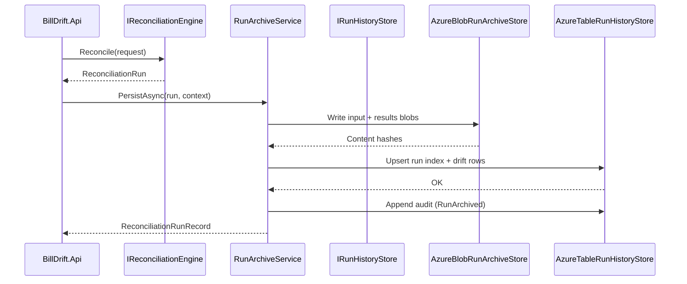

# Contract: Run History Pipeline

**Feature**: `008-reconciliation-run-history`  
**Project**: `BillDrift.Application.History`  
**Date**: 2026-07-02

## Overview

After reconciliation completes, the orchestration layer persists an immutable run record. The reconciliation engine itself is unchanged — persistence is a post-run concern.



---

## Entry Point

### `RunArchiveService.PersistAsync`

```csharp
Task<ReconciliationRunRecord> PersistAsync(
    PersistRunRequest request,
    CancellationToken cancellationToken = default);
```

**Preconditions**:
- `request.Run` is non-null with valid `RunId`
- `request.Context.InputMetadata` contains entries for all five `InputDomainType` values (present or absent)

**Behaviour**:
1. Set status `InProgress` on run index row (insert if new)
2. Serialize normalized inputs from `run.Inputs` to blob paths per [azure-blob-run-archive.md](./azure-blob-run-archive.md)
3. Serialize results (`MatchGroups`, `Mismatches`, `ProposedChanges`) to results blobs
4. Compute `ContentHash` per blob; write `manifest.json`
5. Compute `StableMismatchKey` for each mismatch; upsert `drift` index rows
6. Upsert `run` index row with summary metrics; set status `Completed`
7. Append `audit` row (`RunArchived`)

**On failure**: Set status `Failed` with `FailureReason`; retain partial blobs for diagnosis.

**Idempotency**: Same `RunId` + `Status=InProgress|Failed` allows retry overwrite. `Status=Completed` rejects re-persist (HTTP 409 from API).

---

## Read Path

### `RunHistoryService`

| Method | Purpose |
|--------|---------|
| `ListRunsAsync(filter)` | Query table `run` partition |
| `GetRunSummaryAsync(runId)` | Table read only — list/detail header |
| `GetRunDetailAsync(runId)` | Table + selective blob reads + approval join |
| `CompareRunsAsync(earlierId, laterId)` | Load two result snapshots; delegate to `RunComparisonService` |
| `GetDriftTrendsAsync(window)` | Query `drift` index; aggregate |
| `GetPricingDriftTimelineAsync(commercialKey, window)` | Load pricing/stripe input blobs across runs |

---

## Integration with Reconciliation API

Existing reconciliation endpoint (or new orchestration endpoint) calls persist after engine:

```text
POST /api/reconciliation/runs
  → engine.Reconcile()
  → runArchive.PersistAsync()
  → optional: approvalIngest (007) if auto-ingest enabled
  → return runId + summary
```

Persist is **synchronous** in v1 (operator waits for archive completion). Async background persist deferred until run sizes require it.

---

## Integration with Approval Workflow (007)

- Persist does **not** call approval ingest automatically (operator may ingest separately).
- `GetRunDetailAsync` joins `IApprovalStore.ListProposalsByRunAsync(runId)` for proposal status links.
- Export metadata from 007 queryable via `IApprovalStore` — referenced in run detail, not copied.

---

## Audit Events

| EventType | When |
|-----------|------|
| `RunArchiveStarted` | Persist begins |
| `RunArchived` | Persist completes |
| `RunArchiveFailed` | Persist fails |
| `RunCompared` | Comparison report generated |
| `DriftTrendsViewed` | Trend query executed |
| `RunHistoryExported` | Operator exports comparison/trend report |

---

## Error Handling

| Condition | Response |
|-----------|----------|
| Run not found | 404 |
| Re-persist completed run | 409 |
| Blob integrity hash mismatch | 500 with logged corruption alert |
| Missing approval store data | Degrade gracefully — `ProposalStatusLink.DecisionState = unknown` |

---

## Non-Goals

- Triggering reconciliation (caller responsibility)
- Modifying stored run results
- Stripe write-back execution
