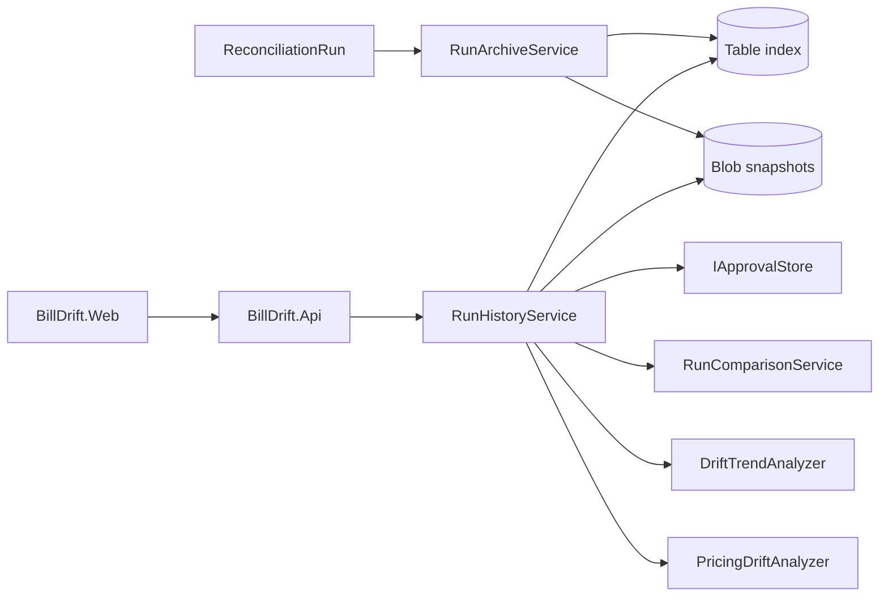
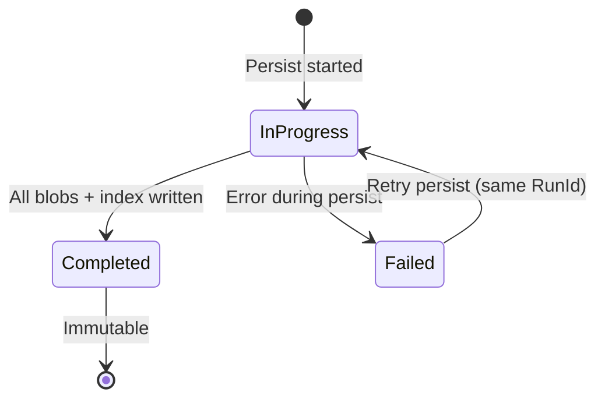

# Data Model: Reconciliation Run History & Audit

**Feature**: `008-reconciliation-run-history`  
**Projects**: `BillDrift.Domain.History`, `BillDrift.Application.History`, `BillDrift.Infrastructure.History`, `BillDrift.Api`, `BillDrift.Web`  
**Date**: 2026-07-02

## Overview

Run history persists immutable reconciliation run records. Azure Table Storage holds queryable metadata and drift indexes; Azure Blob Storage holds normalized input and results JSON. Application services compute comparisons and trends from deserialized snapshots. Approval status is joined from feature 007 at read time.

---

## Domain Types (`BillDrift.Domain.History`)

### `RunArchiveStatus` (enum)

| Value | Meaning |
|-------|---------|
| `InProgress` | Persist started; blobs may be partial |
| `Completed` | Immutable finalized run |
| `Failed` | Persist or reconciliation failed; partial state retained |

### `InputDomainType` (enum)

| Value | Source |
|-------|--------|
| `SupplierCost` | Giacom PDF ingestion |
| `SubscriptionTruth` | Subscription Management report |
| `IntendedPricing` | ResellerPricingVsRRP.csv + manual overrides |
| `StripeBilling` | Stripe subscriptions + products + prices |
| `ProductMappings` | Canonical mapping rules snapshot |

### `InputSnapshotMetadata` (sealed record)

| Field | Type | Description |
|-------|------|-------------|
| `Domain` | `InputDomainType` | Which input domain |
| `IsPresent` | `bool` | Whether data was available for this run |
| `SourceFileName` | `string?` | Original upload/export filename |
| `UploadedAt` | `DateTimeOffset?` | Ingestion timestamp |
| `ContentFingerprint` | `string?` | SHA-256 of source file bytes |
| `BillingPeriodScope` | `BillingPeriod?` | Period covered by this input |
| `RecordCount` | `int` | Normalized line count (0 if absent) |
| `BlobPath` | `string?` | Relative path within run prefix |
| `ContentHash` | `string?` | SHA-256 of normalized JSON blob |

### `MappingVersionReference` (sealed record)

| Field | Type | Description |
|-------|------|-------------|
| `VersionId` | `string` | Operator or system label (e.g. `2026-07-02`) |
| `ContentHash` | `string` | SHA-256 of ordered product mappings JSON |
| `EffectiveDate` | `DateOnly` | Date mappings were effective |
| `Label` | `string?` | Human-readable description |

### `ReconciliationRunRecord` (sealed record)

| Field | Type | Description |
|-------|------|-------------|
| `RunId` | `RunId` | Unique run identifier |
| `Status` | `RunArchiveStatus` | Archive lifecycle state |
| `BillingPeriodScope` | `BillingPeriod` | Run scope |
| `StartedAt` | `DateTimeOffset` | Reconciliation start |
| `CompletedAt` | `DateTimeOffset?` | Reconciliation/archive completion |
| `InitiatorId` | `string?` | Operator or system identity |
| `MappingVersion` | `MappingVersionReference` | Mapping rules used |
| `InputSnapshots` | `IReadOnlyList<InputSnapshotMetadata>` | Per-domain metadata |
| `SummaryMetrics` | `RunSummaryMetrics` | Counts for list views |
| `FailureReason` | `string?` | Set when `Status=Failed` |
| `ManifestBlobPath` | `string` | `{runId}/manifest.json` |
| `IsArchived` | `bool` | Retention tier flag |
| `ArchivedAt` | `DateTimeOffset?` | When moved to archive tier |
| `RetentionExpiresAt` | `DateTimeOffset?` | Policy expiry |

### `RunSummaryMetrics` (sealed record)

| Field | Type | Description |
|-------|------|-------------|
| `MatchGroupCount` | `int` | Total match groups |
| `MismatchCount` | `int` | Total exceptions |
| `MismatchCountByCategory` | `IReadOnlyDictionary<string, int>` | By `MismatchType` name |
| `ProposedChangeCount` | `int` | Total proposals |
| `CleanRun` | `bool` | True when zero mismatches |

### `RunResultsSnapshot` (sealed record)

Deserialized from blob payloads — not stored in table.

| Field | Type | Description |
|-------|------|-------------|
| `RunId` | `RunId` | Parent run |
| `MatchGroups` | `IReadOnlyList<EntityMatchGroup>` | From domain reconciliation |
| `Mismatches` | `IReadOnlyList<Mismatch>` | Frozen exceptions |
| `ProposedChanges` | `IReadOnlyList<ProposedChange>` | Frozen proposals |
| `ContentHash` | `string` | Integrity hash of combined results blobs |

### `StableMismatchKey` (readonly record struct)

| Field | Type | Description |
|-------|------|-------------|
| `Value` | `string` | Deterministic cross-run key |

Factory in Application: `StableMismatchKeyFactory.Create(Mismatch)`.

### `RunComparisonReport` (sealed record)

| Field | Type | Description |
|-------|------|-------------|
| `EarlierRunId` | `RunId` | Baseline run |
| `LaterRunId` | `RunId` | Comparison run |
| `GeneratedAt` | `DateTimeOffset` | Report timestamp |
| `MappingVersionChanged` | `bool` | Hash differs between runs |
| `InputChangeSummaries` | `IReadOnlyList<InputChangeSummary>` | Per-domain deltas |
| `ExceptionDeltas` | `ExceptionDeltaReport` | New/resolved/persisting |
| `ProposalDeltas` | `ProposalDeltaReport` | Proposal changes between runs |

### `InputChangeSummary` (sealed record)

| Field | Type | Description |
|-------|------|-------------|
| `Domain` | `InputDomainType` | Input domain |
| `EarlierRecordCount` | `int` | Lines in earlier run |
| `LaterRecordCount` | `int` | Lines in later run |
| `EarlierFingerprint` | `string?` | Source file fingerprint |
| `LaterFingerprint` | `string?` | Source file fingerprint |
| `FingerprintChanged` | `bool` | Source file replaced |

### `ExceptionDeltaReport` (sealed record)

| Field | Type | Description |
|-------|------|-------------|
| `NewExceptions` | `IReadOnlyList<ComparedMismatch>` | In later only |
| `ResolvedExceptions` | `IReadOnlyList<ComparedMismatch>` | In earlier only |
| `PersistingExceptions` | `IReadOnlyList<PersistingMismatch>` | Both runs |

### `ComparedMismatch` (sealed record)

| Field | Type | Description |
|-------|------|-------------|
| `StableKey` | `StableMismatchKey` | Cross-run identity |
| `Mismatch` | `Mismatch` | Full mismatch from relevant run |
| `RunId` | `RunId` | Source run |

### `PersistingMismatch` (sealed record)

| Field | Type | Description |
|-------|------|-------------|
| `StableKey` | `StableMismatchKey` | Cross-run identity |
| `EarlierMismatch` | `Mismatch` | Earlier run instance |
| `LaterMismatch` | `Mismatch` | Later run instance |
| `ValuesChanged` | `bool` | Expected/actual differ between runs |
| `ApprovalStatusSummary` | `string?` | Joined from 007 if proposal exists |

### `DriftTrendEntry` (sealed record)

| Field | Type | Description |
|-------|------|-------------|
| `StableKey` | `StableMismatchKey` | Cross-run identity |
| `CustomerMexId` | `MexId?` | Customer |
| `CommercialKeyRoot` | `CommercialKeyRoot?` | Product identity |
| `MismatchType` | `MismatchType` | Issue category |
| `OccurrenceCount` | `int` | Runs in window containing this mismatch |
| `FirstSeenRunId` | `RunId` | First occurrence |
| `LastSeenRunId` | `RunId` | Most recent occurrence |
| `FirstSeenAt` | `DateTimeOffset` | First run date |
| `LastSeenAt` | `DateTimeOffset` | Last run date |
| `IsRecurring` | `bool` | `OccurrenceCount >= 2` |
| `ProposalDecisionSummary` | `string?` | Aggregated approval states across runs |

### `PricingDriftTimelineEntry` (sealed record)

| Field | Type | Description |
|-------|------|-------------|
| `CommercialKey` | `CommercialKey` | Product/term/frequency key |
| `RunId` | `RunId` | Run where event observed |
| `RunDate` | `DateTimeOffset` | Run timestamp |
| `EventType` | `PricingDriftEventType` | Event classification |
| `IntendedAmount` | `decimal?` | RRP amount at this run |
| `OverrideAmount` | `decimal?` | Manual override if present |
| `StripeCatalogueAmount` | `decimal?` | Stripe price amount |
| `Currency` | `string?` | ISO currency |
| `LagRunsPersisted` | `int?` | Runs catalogue lag persisted (computed) |

### `PricingDriftEventType` (enum)

| Value | Meaning |
|-------|---------|
| `RrpChanged` | Intended retail price amount changed |
| `OverrideAdded` | Manual override introduced |
| `OverrideRemoved` | Manual override removed |
| `StripePriceChanged` | Stripe catalogue amount changed |
| `CatalogueMissing` | Required Stripe price absent |
| `CatalogueAligned` | Prior lag resolved |

### `ProposalStatusLink` (sealed record)

Read model — not persisted in history store.

| Field | Type | Description |
|-------|------|-------------|
| `ProposedChangeId` | `ProposedChangeId` | Engine proposal ID |
| `IdempotencyKey` | `IdempotencyKey` | Approval store key |
| `DecisionState` | `ApprovalDecisionState` | Current state from 007 |
| `DecidedBy` | `string?` | Operator |
| `DecidedAt` | `DateTimeOffset?` | Decision timestamp |
| `RejectionReason` | `string?` | If rejected |
| `SupersededByRunId` | `RunId?` | Stale/historical link |

### `ExecutionOutcome` (sealed record) — future-ready

| Field | Type | Description |
|-------|------|-------------|
| `ProposedChangeId` | `ProposedChangeId` | Target proposal |
| `Status` | `ExecutionOutcomeStatus` | Pending/Succeeded/Failed |
| `ExecutedAt` | `DateTimeOffset?` | When apply attempted |
| `OutcomeSummary` | `string?` | Result description |
| `ErrorDetail` | `string?` | Failure detail |

### `ExecutionOutcomeStatus` (enum)

| Value | Meaning |
|-------|---------|
| `NotApplicable` | Write-back not enabled |
| `Pending` | Approved, awaiting apply |
| `Succeeded` | Applied successfully |
| `Failed` | Apply attempted, failed |

---

## Application Types

### `RunArchiveContext` (sealed record)

| Field | Type | Description |
|-------|------|-------------|
| `InitiatorId` | `string?` | Who triggered the run |
| `InputMetadata` | `IReadOnlyDictionary<InputDomainType, InputSnapshotMetadata>` | Per-domain upload metadata from ingestion |
| `MappingVersion` | `MappingVersionReference` | Resolved mapping version |
| `StartedAt` | `DateTimeOffset` | Run start time |

### `PersistRunRequest` (sealed record)

| Field | Type | Description |
|-------|------|-------------|
| `Run` | `ReconciliationRun` | Completed engine output |
| `Context` | `RunArchiveContext` | Archive metadata |

### `RunHistoryListFilter` (sealed record)

| Field | Type | Description |
|-------|------|-------------|
| `BillingPeriodStart` | `DateOnly?` | Filter start |
| `BillingPeriodEnd` | `DateOnly?` | Filter end |
| `FromDate` | `DateTimeOffset?` | Run date range |
| `ToDate` | `DateTimeOffset?` | Run date range |
| `Status` | `RunArchiveStatus?` | Status filter |
| `CleanRunsOnly` | `bool?` | Zero-exception filter |
| `IncludeArchived` | `bool` | Include archived runs |

---

## Infrastructure Mapping

| Domain Type | Table Entity | Blob |
|-------------|--------------|------|
| `ReconciliationRunRecord` | `run` partition | `manifest.json` |
| `InputSnapshotMetadata` | `input` partition (per domain) | `inputs/*.json` |
| Drift index row | `drift` partition | — |
| Audit event | `audit` partition | — |
| `RunResultsSnapshot` | summary counts on `run` row | `results/*.json` |

See [contracts/azure-table-schema.md](./contracts/azure-table-schema.md) and [contracts/azure-blob-run-archive.md](./contracts/azure-blob-run-archive.md).

---

## State Transitions

Reconciliation failures before engine completion may still create `Failed` records with partial inputs when orchestration captures them.

---

## Validation Rules

- `Completed` runs MUST NOT be updated except `IsArchived` / retention fields.
- Each `InputDomainType` MUST appear exactly once in `InputSnapshots` with explicit `IsPresent`.
- `StableMismatchKey` MUST be deterministic for identical mismatch semantics across runs.
- Blob `ContentHash` MUST match manifest hash on read; mismatch → integrity error.
- `RetentionExpiresAt` MUST be ≥ `CompletedAt` + configured minimum (default 24 months).
