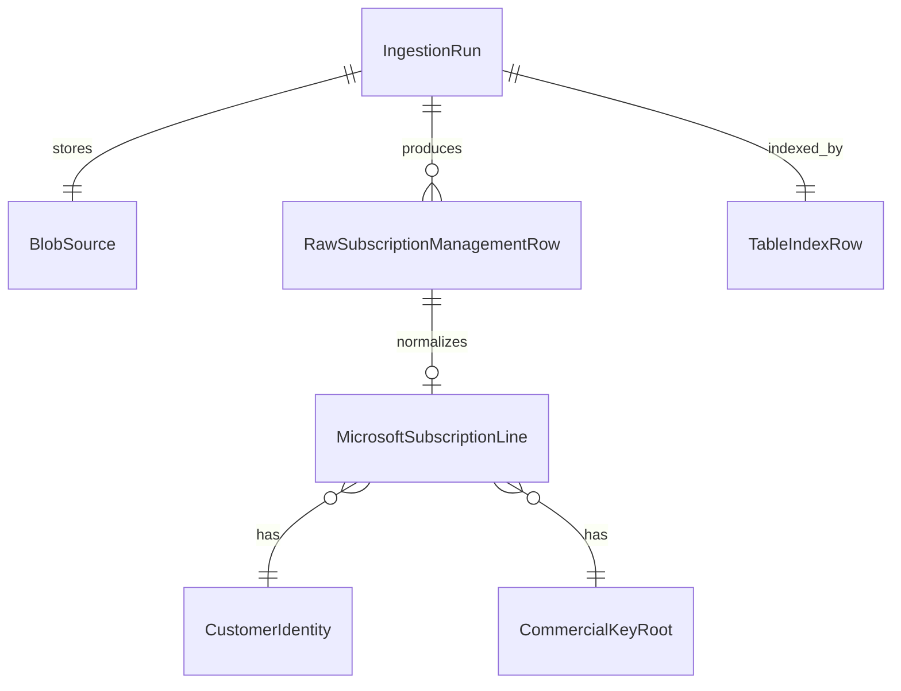

# Data Model: Giacom Subscription Management CSV Ingestion

**Feature**: `009-giacom-subscription-csv`  
**Date**: 2026-07-03

Pipeline-specific types extend the billing domain (001). Output normalized records are `MicrosoftSubscriptionLine` instances ready for reconciliation engine `ReconciliationInputs.SubscriptionLines`.

## Type Placement

| Layer | Namespace | Types |
|-------|-----------|-------|
| Application | `BillDrift.Application.Import` | Public ingester contract, request, result DTOs |
| Application | `BillDrift.Application.Import.SubscriptionManagement` | Orchestration service for upload + persist |
| Application | `BillDrift.Application.Normalization` | `SubscriptionManagementNormalizer` |
| Infrastructure | `BillDrift.Infrastructure.Import.Giacom.SubscriptionManagement` | CSV parser, scope filter, mapper |
| Infrastructure | `BillDrift.Infrastructure.Import.Giacom.SubscriptionManagement.Internal` | Parse-stage row DTOs |
| Infrastructure | `BillDrift.Infrastructure.Ingestion` | Azure blob + table stores |
| Domain | `BillDrift.Domain.Import` | Extended `RawSubscriptionManagementRow` |
| Domain | `BillDrift.Domain.Billing` | Extended `MicrosoftSubscriptionLine`, new VOs |

## Domain Extensions (001)

### `RawSubscriptionManagementRow` (extended)

Existing fields retained. **Add**:

| Field | Type | Notes |
|-------|------|-------|
| `ServiceRaw` | `string?` | As exported |
| `ProductNameRaw` | `string?` | Distinct from implicit product in 001 stub |
| `ProductTypeRaw` | `string?` | CSP / NCE / etc. as written |
| `IsNceRaw` | `string?` | Raw flag text |
| `IsTrialRaw` | `string?` | Raw flag text |
| `PriceRaw` | `string?` | Wholesale/price column |
| `ErpRaw` | `string?` | ERP column when present |
| `EndOfTermActionRaw` | `string?` | Auto-renew / cancel / etc. |
| `CancellableUntilRaw` | `string?` | Date text |
| `MigrationToNceRaw` | `string?` | Migration indicator text |
| `AssignedLicencesRaw` | `string?` | Assigned seat count text |

### `ProductDisplayFacts` (new VO)

| Field | Type |
|-------|------|
| `Service` | `string?` |
| `ProductName` | `string?` |
| `ProductType` | `string?` |

### `SubscriptionLifecycleFacts` (new VO)

| Field | Type |
|-------|------|
| `IsNce` | `bool?` |
| `IsTrial` | `bool?` |
| `EndOfTermAction` | `string?` |
| `CancellableUntil` | `DateOnly?` |
| `MigrationToNce` | `string?` |
| `AssignedLicenceCount` | `int?` |
| `Price` | `Money?` |
| `ErpPrice` | `Money?` |

### `MicrosoftSubscriptionLine` (extended)

Add optional parameters:

| Field | Type | Notes |
|-------|------|-------|
| `ProductDisplay` | `ProductDisplayFacts?` | Names as written; not used for matching |
| `Lifecycle` | `SubscriptionLifecycleFacts?` | Optional lifecycle/pricing context |

## Application Layer (Public)

### `SubscriptionManagementCsvIngestionOptions`

| Field | Type | Default |
|-------|------|---------|
| `MaxFileSizeBytes` | `long` | `10_485_760` (10 MB) |
| `NormalizeOutput` | `bool` | `true` | When false, return raw rows only (test hook) |

### `SubscriptionManagementCsvIngestionRequest`

| Field | Type |
|-------|------|
| `Content` | `Stream` |
| `OriginalFileName` | `string?` |
| `Options` | `SubscriptionManagementCsvIngestionOptions` |

### `SubscriptionManagementCsvIngestionSummary`

| Field | Type |
|-------|------|
| `RowsRead` | `int` |
| `RowsEmitted` | `int` |
| `RowsSkipped` | `int` |
| `RowsExcludedByScope` | `int` |
| `NormalizationSkipped` | `int` |
| `CommercialKeyWarnings` | `int` |
| `ScopeAmbiguityWarnings` | `int` |

### `SubscriptionManagementCsvIngestionResult`

| Field | Type |
|-------|------|
| `IngestionId` | `Guid` | Correlates blob/table artifacts |
| `SourceDocumentId` | `string` | SHA-256 hex of CSV bytes |
| `IngestedAt` | `DateTimeOffset` |
| `Status` | `IngestionOutcomeStatus` |
| `RawRows` | `IReadOnlyList<RawSubscriptionManagementRow>` |
| `SubscriptionLines` | `IReadOnlyList<MicrosoftSubscriptionLine>` |
| `LogEntries` | `IReadOnlyList<IngestionLogEntry>` |
| `Summary` | `SubscriptionManagementCsvIngestionSummary` |
| `SourceFile` | `SubscriptionManagementSourceFileInfo` |

### `SubscriptionManagementIngestionRun` (persistence index)

| Field | Type |
|-------|------|
| `IngestionId` | `Guid` |
| `SourceKind` | `ImportSourceKind` | Always `GiacomSubscriptionManagement` |
| `OriginalFileName` | `string?` |
| `ContentFingerprint` | `string` | Same as `SourceDocumentId` |
| `UploadedAt` | `DateTimeOffset` |
| `CompletedAt` | `DateTimeOffset?` |
| `Status` | `IngestionRunStatus` |
| `Summary` | `SubscriptionManagementCsvIngestionSummary` |
| `SourceBlobPath` | `string` |
| `ResultManifestBlobPath` | `string?` |
| `FailureReason` | `string?` |

### `IngestionRunStatus`

```csharp
public enum IngestionRunStatus
{
    InProgress = 0,
    Completed = 1,
    PartialSuccess = 2,
    Failed = 3
}
```

## Infrastructure Parse Stage

### `ParsedSubscriptionManagementRow` (internal)

Flat string dictionary keyed by logical field names after header mapping. Converted to `RawSubscriptionManagementRow` by `RawSubscriptionManagementRowMapper`.

## Idempotency

```
RawImportId = (
  SourceKind: GiacomSubscriptionManagement,
  SourceDocumentId: sha256(csvBytes),
  SourceLineKey: "{rowNumber}"
)
```

Re-import of identical bytes produces identical `RawImportId` set. `IngestionId` (upload run) is unique per API call.

## Persistence Layout

See [contracts/azure-blob-ingestion-archive.md](./contracts/azure-blob-ingestion-archive.md) and [contracts/azure-table-ingestion-index.md](./contracts/azure-table-ingestion-index.md).

```
ingestion-uploads/{ingestionId}/
  source/SubscriptionManagementReport.csv
  result/manifest.json
  result/raw-rows.json
  result/subscription-truth.json
```

## Relationships



## Validation Rules

| Rule | Stage |
|------|-------|
| Mex ID non-empty after trim | Row skip if missing |
| Licence count parseable when column non-empty | Row skip if invalid |
| Price parseable when column non-empty | Row skip if invalid |
| Offer ID + SKU ID | Warning if either missing; raw row still emitted |
| Scope filter | Exclude non-M365/CSP before raw mapping |
| Normalization | Skip line when Mex ID invalid or licence count invalid; log `NormalizationSkipped` |
