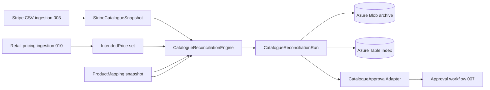

# Data Model: Stripe Catalogue Reconciliation

**Feature**: `011-stripe-catalogue-reconciliation`  
**Projects**: `BillDrift.Domain.CatalogueReconciliation`, `BillDrift.Application.CatalogueReconciliation`, `BillDrift.Infrastructure.CatalogueReconciliation`, `BillDrift.Api`  
**Date**: 2026-07-03

## Overview

Catalogue reconciliation compares a Stripe product/price snapshot against canonical product mappings and intended retail pricing, emitting typed exceptions and approval-ready proposed fixes. Persistence uses Azure Blob (snapshots) + Azure Table (index) via Aspire-injected clients.



---

## Domain Types (`BillDrift.Domain.CatalogueReconciliation`)

### `CatalogueExceptionType` (enum)

| Value | Spec mapping |
|-------|----------------|
| `MissingProduct` | Stripe product not found for mapped offer/SKU |
| `MissingPrice` | Required term/frequency price absent |
| `IncorrectPrice` | Amount or currency mismatch vs intended RRP |
| `DuplicateProduct` | Multiple Stripe products for same offer/SKU |
| `DuplicatePrice` | Multiple active prices for same product + interval + currency |
| `PricingReferenceGap` | Mapped product lacks intended pricing record |
| `MappingAmbiguous` | Low confidence or conflicting mapping prevents check |
| `UnmappedCatalogueEntry` | Stripe product/price with no mapping or metadata |

### `CatalogueProposedActionType` (enum)

| Value | Approval mapping |
|-------|------------------|
| `CreateProduct` | `ProposedActionType.CreateOrUpdateCatalogueEntry` |
| `CreatePrice` | `CreateOrUpdateCatalogueEntry` |
| `CreateReplacementPrice` | `CreateOrUpdateCatalogueEntry` |
| `FlagManualCleanup` | Investigation / `ApprovalEligibility.CatalogueConflict` |

### `CatalogueRunId` (value object)

GUID-based run identifier; distinct from `RunId` (004 customer reconciliation) to avoid collision in storage namespaces.

### `CatalogueReconciliationInputs` (sealed record)

| Field | Type | Description |
|-------|------|-------------|
| `StripeProducts` | `IReadOnlyList<StripeCatalogueProduct>` | Normalized product snapshot |
| `StripePrices` | `IReadOnlyList<StripeCataloguePrice>` | Normalized price snapshot |
| `ProductMappings` | `IReadOnlyList<ProductMapping>` | Canonical mapping entries |
| `IntendedPrices` | `IReadOnlyList<IntendedPrice>` | Resolved pricing reference (010 output) |
| `InputReferences` | `CatalogueInputReferences` | Ingestion run IDs, blob paths, content hashes |

### `CatalogueInputReferences` (sealed record)

| Field | Type | Description |
|-------|------|-------------|
| `StripeIngestionRunId` | `Guid?` | Source Stripe CSV ingestion |
| `PricingIngestionRunId` | `Guid?` | Source retail pricing ingestion |
| `MappingVersionId` | `string?` | Mapping snapshot label |
| `MappingContentHash` | `string?` | SHA-256 of mapping JSON |

### `StripeCatalogueProduct` (sealed record)

| Field | Type | Description |
|-------|------|-------------|
| `ProductId` | `StripeProductId` | Stripe product ID |
| `Name` | `string` | Product name |
| `OfferId` | `OfferId?` | From metadata |
| `SkuId` | `SkuId?` | From metadata |
| `IsActive` | `bool` | Active vs archived |
| `Metadata` | `IReadOnlyDictionary<string, string>` | Raw metadata preserved |

### `StripeCataloguePrice` (sealed record)

| Field | Type | Description |
|-------|------|-------------|
| `PriceId` | `StripePriceId` | Stripe price ID |
| `ProductId` | `StripeProductId` | Parent product |
| `UnitAmount` | `Money` | Minor units + currency |
| `Frequency` | `BillingFrequency` | Billing interval |
| `Term` | `Term?` | When derivable from metadata or nickname |
| `IsActive` | `bool` | Active vs archived |

### `CatalogueException` (sealed record)

| Field | Type | Description |
|-------|------|-------------|
| `Id` | `CatalogueExceptionId` | Surrogate ID |
| `Type` | `CatalogueExceptionType` | Exception category |
| `CommercialKey` | `CommercialKey?` | When applicable |
| `CommercialKeyRoot` | `CommercialKeyRoot?` | Offer/SKU scope |
| `Severity` | `MismatchSeverity` | Reuse domain severity |
| `Description` | `string` | Operator-facing explanation |
| `ExpectedValue` | `string?` | e.g. intended RRP |
| `ActualValue` | `string?` | e.g. Stripe amount or "not found" |
| `AffectedStripeProductIds` | `IReadOnlyList<StripeProductId>` | For duplicates |
| `AffectedStripePriceIds` | `IReadOnlyList<StripePriceId>` | For price issues |
| `MappingId` | `ProductMappingId?` | Source mapping |
| `RuleId` | `string` | Stable rule identifier for tests |

### `CatalogueProposedFix` (sealed record)

| Field | Type | Description |
|-------|------|-------------|
| `Id` | `CatalogueProposedFixId` | Surrogate ID |
| `ExceptionId` | `CatalogueExceptionId` | Source exception |
| `ActionType` | `CatalogueProposedActionType` | Proposed action |
| `IdempotencyKey` | `IdempotencyKey` | Stable for approval supersession |
| `CommercialKeyRoot` | `CommercialKeyRoot?` | Product identity |
| `CommercialKey` | `CommercialKey?` | Price slot identity |
| `PriorState` | `IReadOnlyDictionary<string, string>` | Current Stripe state |
| `ProposedState` | `IReadOnlyDictionary<string, string>` | Target values for create actions |
| `Rationale` | `string` | Human-readable why |
| `IsActionable` | `bool` | False for manual cleanup flags |

### `CatalogueReconciliationSummary` (sealed record)

| Field | Type | Description |
|-------|------|-------------|
| `MappedProductsChecked` | `int` | In-scope mapping entries with pricing |
| `ExceptionsByType` | `IReadOnlyDictionary<CatalogueExceptionType, int>` | Count rollup |
| `ProposedFixesActionable` | `int` | Count eligible for approval |
| `ProposedFixesManualOnly` | `int` | Duplicate/conflict flags |
| `UnmappedStripeProducts` | `int` | Orphan products |
| `UnmappedStripePrices` | `int` | Orphan prices |

### `CatalogueReconciliationRun` (sealed record)

| Field | Type | Description |
|-------|------|-------------|
| `RunId` | `CatalogueRunId` | Run identity |
| `ExecutedAt` | `DateTimeOffset` | UTC completion |
| `Inputs` | `CatalogueReconciliationInputs` | Input snapshot reference or embedded summary |
| `Exceptions` | `IReadOnlyList<CatalogueException>` | All detected issues |
| `ProposedFixes` | `IReadOnlyList<CatalogueProposedFix>` | Approval-ready proposals |
| `Summary` | `CatalogueReconciliationSummary` | Roll-up counts |
| `Options` | `CatalogueReconciliationOptions` | Options used |

### `CatalogueReconciliationOptions` (sealed record)

| Field | Type | Default | Notes |
|-------|------|---------|-------|
| `IncludeArchivedPrices` | `bool` | `false` | Hygiene review for inactive prices |
| `IncludeNonCspProducts` | `bool` | `true` | Bespoke manual overrides |
| `ExactAmountMatch` | `bool` | `true` | No tolerance when true |
| `DefaultCurrency` | `string` | `GBP` | When pricing omits currency |

---

## Application Layer

### `ICatalogueReconciliationEngine`

```csharp
CatalogueReconciliationRun Execute(CatalogueReconciliationInputs inputs, CatalogueReconciliationOptions options);
```

Pure, deterministic, side-effect-free.

### `ICatalogueReconciliationService`

Orchestrates input assembly from ingestion stores, engine execution, blob/table persistence, optional approval ingestion.

### `CatalogueApprovalAdapter`

Maps `CatalogueProposedFix` → approval proposals for 007 ingestion.

### `IStripeCatalogueNormalizer`

`RawStripeProduct` + `RawStripePrice` → `StripeCatalogueProduct` / `StripeCataloguePrice`.

### `StripeCatalogueSnapshotIndex`

In-memory index for product/price lookup, duplicate grouping, and RRP comparison. Built from catalogue snapshots (not subscription items).

---

## Infrastructure Layer

### `ICatalogueReconciliationStore` / `AzureCatalogueReconciliationStore`

| Responsibility | Storage |
|----------------|---------|
| Archive run inputs + results | Blob (`catalogue-reconciliation-runs`) |
| Run list, filter by date | Table (`cataloguereconciliationruns`) |

Constructor: `(BlobServiceClient, TableServiceClient, IOptions<CatalogueReconciliationStorageOptions>)`.

### `InMemoryCatalogueReconciliationStore`

Test double; no Azure dependency.

---

## Persistence Entities (Azure Table)

### Partition / Row Key

| Entity | PartitionKey | RowKey |
|--------|--------------|--------|
| Run index | `catalogue` | `{CatalogueRunId:D}` |

### Indexed fields (flattened on run row)

`ExecutedAt`, `StripeIngestionRunId`, `PricingIngestionRunId`, `TotalExceptions`, `MissingProductCount`, `MissingPriceCount`, `IncorrectPriceCount`, `DuplicateCount`, `BlobManifestPath`, `Status`.

---

## Relationships to Existing Domain

| Existing type | Usage |
|---------------|-------|
| `ProductMapping` | Input; drives iteration scope |
| `IntendedPrice` | Expected RRP per commercial key |
| `CommercialKey`, `CommercialKeyRoot` | Correlation |
| `ProposedChange`, `CatalogueEntryPayload` | Approval adapter target |
| `MismatchType.CatalogueMissing` | Adapter maps subset of catalogue exceptions |

---

## Validation Rules

1. Empty Stripe catalogue → run completes with error summary, no invented exceptions.
2. Mapping entry without any intended price → `PricingReferenceGap` only; no missing-price for unknown RRP keys.
3. Duplicate product detection runs before per-product missing checks (avoid duplicate missing-product noise).
4. `MappingAmbiguous` suppresses missing/incorrect price assertions for that root.
5. `CreateReplacementPrice` required when incorrect price on active Stripe price (immutable amount semantics).
