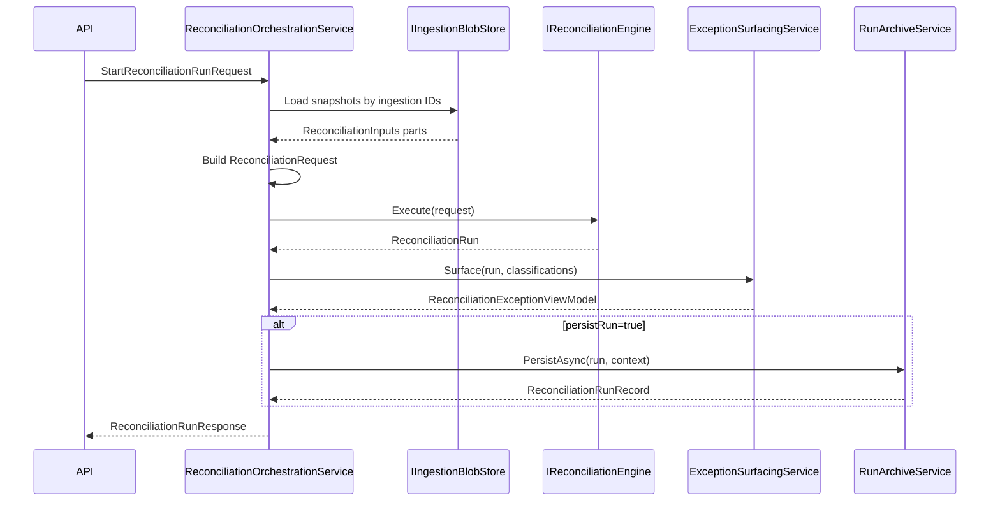

# Contract: Reconciliation Orchestration API Endpoints

**Feature**: `013-v1-mvp-ui`  
**Project**: `BillDrift.Api`  
**Date**: 2026-07-03

## Purpose

Provide the missing HTTP entry point for end-to-end reconciliation: load ingestion snapshots → execute engine → surface exceptions → optionally archive → return operator summary. Implements 008 `run-history-pipeline.md` integration contract.

---

## Routes

Base: `/api/reconciliation`

| Method | Path | Description |
|--------|------|-------------|
| `POST` | `/runs` | Start reconciliation run |
| `GET` | `/runs/{runId:guid}` | Get run summary + exceptions (from archive or session) |
| `GET` | `/runs/{runId:guid}/margin` | Get margin display rows for run |

---

## POST `/runs`

**Request body**: `StartReconciliationRunRequest`

```json
{
  "billingPeriod": { "start": "2026-06-01", "end": "2026-06-30" },
  "supplierCostIngestionId": "guid",
  "subscriptionTruthIngestionId": "guid",
  "intendedPricingIngestionId": "guid",
  "stripeBillingIngestionId": "guid",
  "productMappings": [ /* ProductMapping[] */ ],
  "options": {
    "includeNonCspProducts": false,
    "proposeCatalogueChanges": true
  },
  "persistRun": true,
  "initiatorId": "operator@example.com"
}
```

**Pre-checks** (return `400` with missing list):
- Warn/block if zero ingestion IDs provided
- Warn if `productMappings` empty (reconciliation will produce limited results)
- Validate referenced ingestion runs exist

**Behaviour** (`ReconciliationOrchestrationService.ExecuteAsync`):



**Response** `200 OK`: `ReconciliationRunResponse`

**Errors**:

| Status | Condition |
|--------|-----------|
| 400 | Invalid request / missing ingestion references |
| 404 | Referenced ingestion run not found |
| 409 | Re-persist conflict (via archive service) |
| 500 | Engine invariant violation |

---

## GET `/runs/{runId}`

Loads from run history when archived; returns summary + exceptions.

**Query**: `includeResults` (default `true`)

**Response** `200 OK`: `ReconciliationRunResponse`  
**Response** `404`: Run not found

---

## GET `/runs/{runId}/margin`

Returns `MarginLineViewModel[]` derived from reconciliation run evidence fields. No new margin calculation — maps existing cost/RRP data from run results and exception evidence.

**Response** `200 OK`: `MarginLineViewModel[]`  
**Response** `404`: Run not found

---

## Approval Integration

After run completes, operator triggers proposal ingest via:

```text
POST /api/reconciliation/{runId}/approvals/ingest-from-run
```

See [approval-ingest-convenience.md](./approval-ingest-convenience.md).

---

## Service Registration

```csharp
builder.Services.AddReconciliationEngine(); // existing
builder.Services.AddRunHistory(); // existing
builder.Services.AddScoped<ReconciliationOrchestrationService>();

app.MapReconciliationEndpoints();
```

---

## Input Loading Rules

| Ingestion ID field | Blob store method | ReconciliationInputs field |
|--------------------|-------------------|---------------------------|
| `supplierCostIngestionId` | Get supplier cost lines | `SupplierCostLines` |
| `subscriptionTruthIngestionId` | GetSubscriptionTruthAsync | `MicrosoftSubscriptionLines` |
| `intendedPricingIngestionId` | GetResolvedPricesAsync | `IntendedPrices` |
| `stripeBillingIngestionId` | Get Stripe billing items | `StripeBillingItems` |
| *(inline)* | — | `ProductMappings` |

Classification context loaded from classification store when overrides exist (optional enhancement — v1 may pass null).

---

## Notes

- Engine behaviour unchanged (004).
- Persist synchronous per 008 v1 decision.
- Does not auto-ingest approvals.
